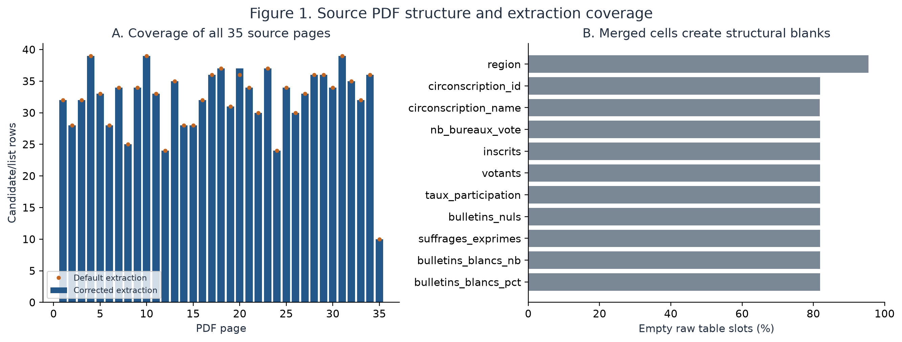
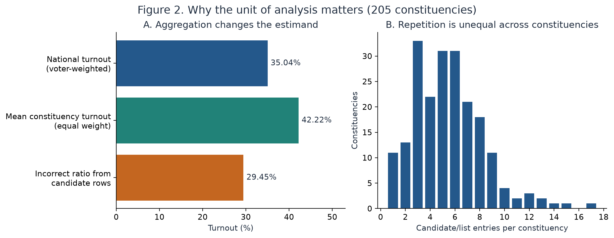
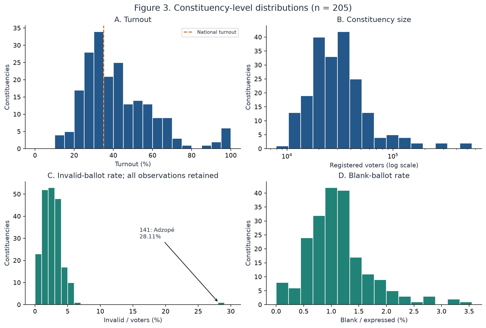
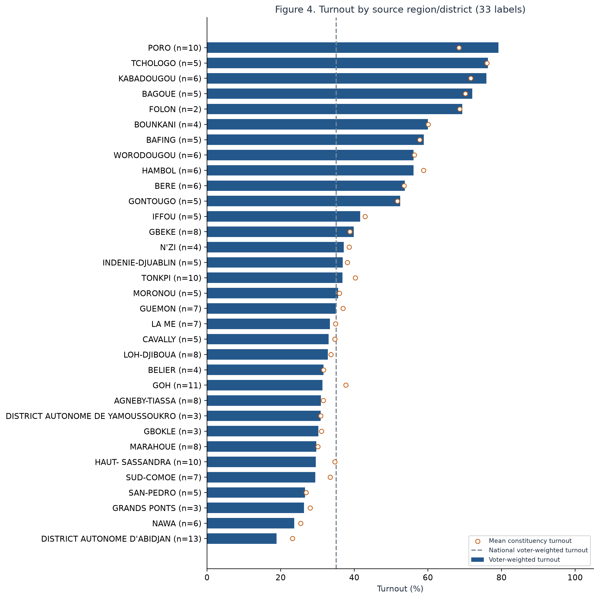
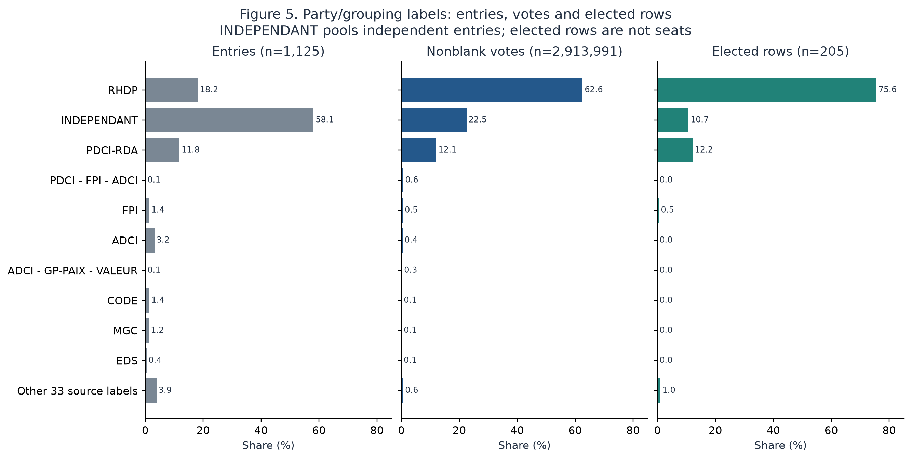
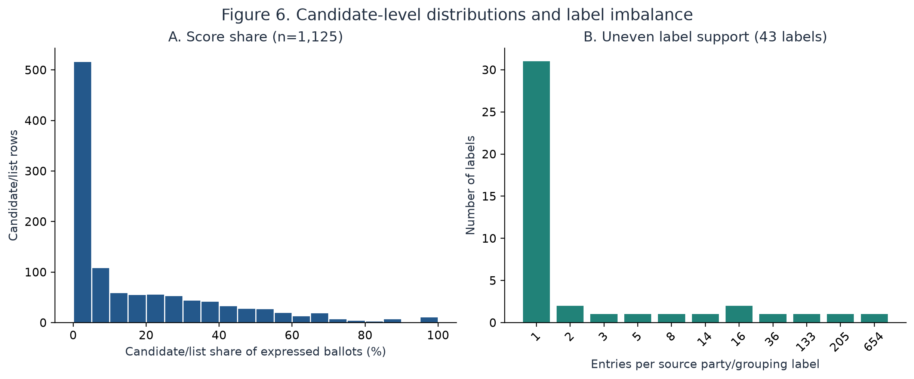
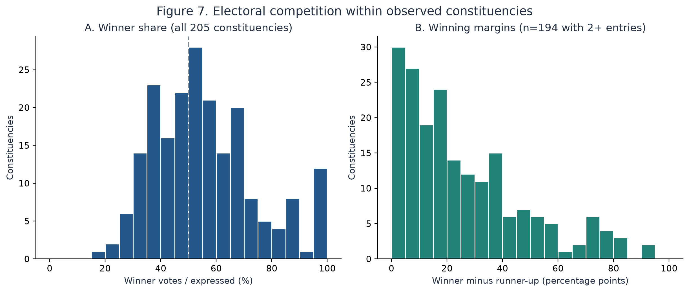
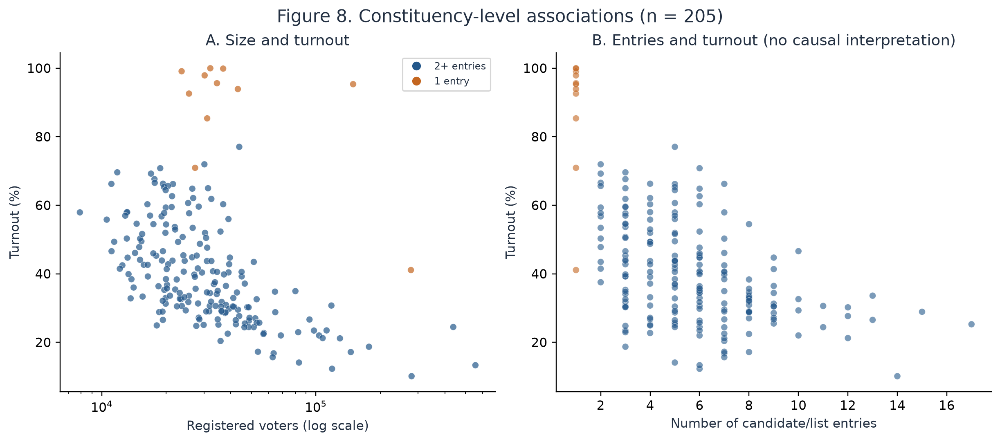
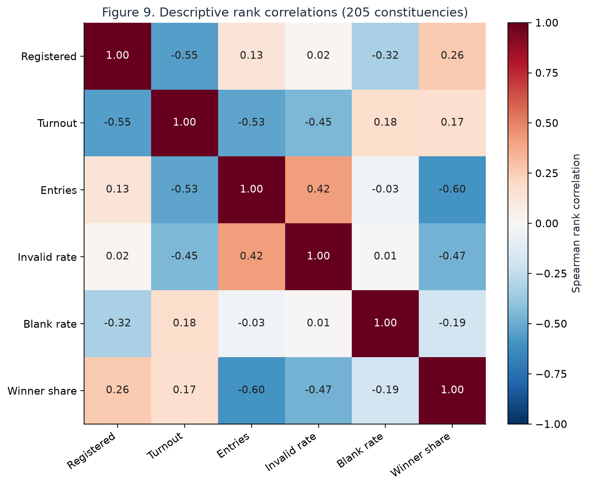

# Exploratory data analysis: Côte d'Ivoire 2025 election results

Source PDF and ingested CSV | Analysis date: 27 September 2026

## 1. Executive findings

The supplied 35-page PDF contains **1,125 candidate/list entries in 205 constituencies**, grouped under **33 region/district labels and 43 party/grouping labels**. The CSV has 16 business fields and three provenance fields. Its business fields contain no missing values or exact duplicate records. All 21 integrity checks pass. A fresh source extraction matches all 21,375 CSV cells after type conversion, and all seven printed national totals reconcile exactly.

National turnout is **35.04%** (3,012,094 voters / 8,597,092 registered), whereas the equal-weight mean constituency turnout is **42.22%**. This difference is substantive: constituencies vary greatly in size. Directly summing repeated constituency totals over candidate rows would inflate registered voters by **5.79 times** and produce an incorrect **29.45%** national turnout.

RHDP-labelled entries account for **62.59%** of nonblank candidate/list votes and **155 of 205 elected rows**. This is not a count of parliamentary seats. INDEPENDANT is a pooled label for 654 entries, not a single political party. There are **11 constituencies with one recorded entry** and **194 with two or more**.

Unusual values are retained. For example, Adzopé (ID 141) records 3,423 invalid ballots among 12,179 voters (**28.11%**), and Odienné (ID 123) records **99.98%** turnout. Both values were visually checked in the PDF. Their presence does not by itself establish a data error or explain the underlying electoral process.

A concise section suitable for the project report is available in [REPORT_SECTION.md](REPORT_SECTION.md). Full precision results are in the linked CSV tables; figures are available as high-resolution PNG and editable SVG.

## 2. Sources, scope and units of observation

The analysis uses `EDAN_2025_RESULTAT_NATIONAL_DETAILS.pdf` and `edan_2025_resultats.csv`. The PDF heading identifies the election as the election of deputies to the National Assembly, with a ballot date of 27 December 2025. This EDA assesses the supplied file and its transcription; it does not independently authenticate the document against an external publisher or later revisions.

The PDF is a born-digital, landscape table document: all 35 pages contain extractable text and one default-detected table per page. Region labels run vertically; constituency labels and totals occupy merged cells; headers repeat between pages; shaded rectangles and unclosed bottom borders complicate extraction. The PDF totals row is an independent accounting target within the same source, not an external validation dataset.

Three distinct analytical units are used:

- **Candidate/list entry, n=1,125:** one row per recorded candidature, identified by constituency, party/grouping and candidate/list label. The natural key is unique in this file. A row can name a person or a list.
- **Constituency, n=205:** one consistent set of registered voters, voters and ballot totals per ID, after checking every repeated field for agreement. IDs remain three-character strings from `001` to `205`, with no gaps. They are identifiers, not numeric model features or a time sequence.
- **Source region/district, n=33:** aggregates of constituencies sharing a printed label. The inventory includes autonomous districts; calling all 33 labels administrative regions would overstate the source semantics.

The same constituency totals appear on every candidate row. All national and regional voter totals are therefore computed at constituency grain. Source page/table/row locates the **candidate row** in the corrected extraction; metadata for a block spanning pages may appear on the following page.

There is one election snapshot. No demographic variables, voting-station-level observations, historical series, seat counts or list-member roster are provided. Candidate/list text cannot reliably determine gender, age, occupation or a unique person identity.

## 3. Raw PDF exploration and ingestion fidelity

Default table extraction exposes 1,195 table rows including headers and 1,124 candidate/list rows. Corrected extraction recovers 1,125 entries, including the last page-20 row (3,760 votes) omitted by the default detector. The raw column profile distinguishes structural blanks in merged cells from missing measurements; an empty election-marker cell means that the row is not marked elected.



**Figure 1.** Page-level extraction counts and blank raw table slots. The raw blank percentages describe the table parser's unfilled merged-cell slots, not unavailable election statistics. The corrected CSV has no missing values in its 16 business columns.

The documented extraction repairs address background rectangles mistaken for table rules, reversed vertical text, omitted unclosed bottom rows and constituency labels split across pages. The previous audit reported 1,124 rows, 204 IDs and missing statistics for five constituencies. The corrected current CSV contains 1,125 rows and 205 IDs. This historical comparison concerns extraction quality, not changes in the election itself.

For this EDA, the source is re-extracted afresh, transformed, sorted on the three provenance fields and compared cell by cell with the existing CSV. Text, IDs and booleans must agree; numeric comparison uses tolerance 1e-12 for floating-point serialization. All 21,375 cells agree. This demonstrates reproducibility and consistency with the extraction rules; it is not independent manual transcription of every candidate name. Separate arithmetic reconciliation and rendered-page checks provide additional evidence.

Source pages 1, 21, 22 and 30 were visually inspected for the national totals, near-tie and high-turnout cases, the high invalid count, and one-entry blocks. The prior ingestion review also inspected pages 2, 10, 17, 20 and 31. No source observations were imputed, dropped, winsorized or relabelled for the analysis.

**National accounting reconciliation**

| metric | printed_pdf_total | csv_total_correct_grain | difference |
| --- | --- | --- | --- |
| nb_bureaux_vote | 25338 | 25338 | 0 |
| inscrits | 8597092 | 8597092 | 0 |
| votants | 3012094 | 3012094 | 0 |
| bulletins_nuls | 68525 | 68525 | 0 |
| suffrages_exprimes | 2943569 | 2943569 | 0 |
| bulletins_blancs_nb | 29578 | 29578 | 0 |
| score | 2913991 | 2913991 | 0 |

The identities `voters = invalid + expressed` and `sum(candidate votes) = expressed - blank` hold separately in every constituency. In this PDF, expressed ballots include blanks: candidate shares and blank shares use expressed ballots as their denominator. A generic alternative definition of “valid votes” must not silently replace this source convention.

Detailed evidence: [page inventory](tables/pdf_page_profile.csv), [raw column profile](tables/raw_column_profile.csv), [quality checks](tables/quality_checks.csv), [rounding checks](tables/percentage_rounding.csv), and [national reconciliation](tables/national_reconciliation.csv).

## 4. Schema, completeness and semantic checks

| column | unit_of_observation | unit | definition |
| --- | --- | --- | --- |
| region | constituency | text | Source region/district label; 33 observed labels. |
| circonscription_id | constituency | text ID | Three-character identifier; preserve leading zeros. |
| circonscription_name | constituency | text | Source constituency name; names can describe multiple communes. |
| nb_bureaux_vote | constituency | count | Polling stations. |
| inscrits | constituency | persons | Registered voters. |
| votants | constituency | persons | Voters; equals invalid plus expressed ballots. |
| taux_participation | constituency | fraction | Voters / registered, rounded in PDF to 0.01 percentage points. |
| bulletins_nuls | constituency | ballots | Invalid ballots; derived rate denominator is voters. |
| suffrages_exprimes | constituency | ballots | Expressed ballots in this source include blank ballots. |
| bulletins_blancs_nb | constituency | ballots | Blank ballots. |
| bulletins_blancs_pct | constituency | fraction | Blank / expressed, rounded in source. |
| parti | candidate/list | text | Party/grouping label; INDEPENDANT pools independent entries. |
| candidat | candidate/list | text | Candidate or list label; not necessarily a person or unique identity. |
| score | candidate/list | votes | Votes for the candidate/list. |
| score_pct | candidate/list | fraction | Score / expressed, rounded in source; includes blanks in denominator. |
| elu | candidate/list | boolean | True for PDF marker ELU(E); not a seat count. |
| source_page | provenance | integer | One-based PDF page of candidate row. |
| source_table | provenance | integer | One-based table after corrected extraction. |
| source_row | provenance | integer | One-based row after corrected extraction, including headers. |

All 19 CSV columns are populated. There are no exact duplicate business rows, duplicate constituency/party/candidate keys or duplicate provenance tuples. Every ID maps to exactly one name and source region, and all repeated constituency fields agree. Integer counts are nonnegative, voters never exceed registrations, and stored percentage fractions lie in [0, 1]. Every constituency has one marked elected row; the marked row has the maximum score, with no tied maximum.

The source prints percentages to two decimal percentage points, so a difference up to 0.0051 percentage points is allowed when comparing them with recomputed ratios. All three source percentage columns satisfy this tolerance. Analytical ratios are recomputed from counts; the original rounded percentages remain unchanged in the input CSV.

There are 1,074 distinct candidate/list strings across 1,125 rows. **18 exact strings occur in multiple constituencies**, often because a shared list label is reused. Names alone are not reliable record identifiers. Accents, punctuation and spacing variants remain in the source labels. A conservative comparison that removes punctuation, spacing and accents identifies potential variants in a separate table, without assuming the labels represent the same entity or merging their votes.

The source label `INDEPENDANT` pools separate entries and can appear repeatedly in one constituency. Coalitions, such as `PDCI - FPI - ADCI`, are kept separate from their component party labels. Canonical party mapping would need additional source-grounded rules.

See the [CSV column profile](tables/csv_column_profile.csv), [text profile](tables/text_profile.csv), [repeated labels](tables/repeated_candidate_labels.csv) and [potential spelling variants](tables/potential_text_variants.csv).

## 5. National totals and aggregation effects

There are 8,597,092 registered voters, 3,012,094 voters and 25,338 polling stations. National invalid-ballot rate is **2.27%** using voters as denominator. Blank ballots are **1.00%** of expressed ballots. Candidate/list votes sum to 2,913,991 after excluding blanks.



**Figure 2.** National turnout weights each constituency by registered voters. Mean constituency turnout gives every constituency equal weight. The third bar deliberately shows the invalid national aggregation obtained by summing constituency totals repeated on candidate rows. The right panel explains why repetition is unequal.

The voter-weighted and equal-constituency rates differ by **7.18 percentage points**. The mean of the printed turnout column over all candidate rows is a fourth quantity, **37.18%**, because it weights constituencies by the number of candidate/list entries. Questions about “average participation” therefore require an explicit definition in the SQL agent and evaluation gold answers. Full formulas and values are in [aggregation_comparison.csv](tables/aggregation_comparison.csv).

## 6. Univariate distributions

| unit | variable | n | mean | std_ddof1 | min | q25 | median | q75 | max |
| --- | --- | --- | --- | --- | --- | --- | --- | --- | --- |
| constituency | inscrits | 205 | 41,937.03 | 57,636.44 | 7,903.00 | 19,869.00 | 28,375.00 | 40,972.00 | 555,901.00 |
| constituency | votants | 205 | 14,693.14 | 15,365.61 | 4,476.00 | 7,970.00 | 11,675.00 | 14,778.00 | 142,250.00 |
| constituency | turnout (%) | 205 | 42.22 | 18.10 | 10.11 | 29.31 | 38.43 | 51.95 | 99.98 |
| constituency | invalid_rate (%) | 205 | 2.68 | 2.22 | 0.00 | 1.58 | 2.49 | 3.45 | 28.11 |
| constituency | blank_rate (%) | 205 | 1.13 | 0.58 | 0.00 | 0.77 | 1.06 | 1.33 | 3.55 |
| constituency | entries | 205 | 5.49 | 2.82 | 1.00 | 3.00 | 5.00 | 7.00 | 17.00 |
| constituency | margin_pp_expressed | 194 | 26.05 | 21.97 | 0.04 | 8.75 | 19.20 | 36.87 | 94.02 |
| constituency | effective_entries | 205 | 2.60 | 1.10 | 1.00 | 1.88 | 2.32 | 3.22 | 7.04 |
| candidate/list | score | 1125 | 2,590.21 | 7,293.66 | 4.00 | 177.00 | 730.00 | 2,719.00 | 141,884.00 |
| candidate/list | score_pct (%) | 1125 | 18.02 | 22.15 | 0.08 | 1.57 | 6.51 | 29.43 | 100.00 |

Rates in this display table are percentages, and winning margins are in percentage points. Standard deviation uses ddof=1 as a conventional descriptive summary. The full [statistics table](tables/descriptive_statistics.csv) retains fractional rate units and also includes 5th/95th percentiles and skewness. Runner-up and margin variables have 11 not-applicable values for one-entry constituencies, not missing source observations.

Constituency size is strongly uneven: registered voters range from **7,903 to 555,901**, with median **28,375**. The ten largest constituencies contain **27.80%** of registrations. The registration histogram uses a logarithmic horizontal scale to show both typical and very large constituencies.

Turnout ranges from **10.11% to 99.98%**, with median **38.43%** and interquartile range **29.31%–51.95%**. Candidate/list counts range from **1 to 17**, with median **5**.



**Figure 3.** All 205 constituencies are included. Invalid-ballot rates use voters; blank-ballot rates use expressed ballots. The Adzopé extreme is shown on the full scale and is not removed from the histogram or national accounting.

## 7. Regional variation

Regional turnout is calculated as `sum(voters) / sum(registered)` using unique constituencies. The highest rate is **PORO (79.14%)** and the lowest is **DISTRICT AUTONOME D'ABIDJAN (18.88%)**. Constituency counts and registered populations differ across these source labels, so the comparison is descriptive and is not a ranking of otherwise equivalent populations.



**Figure 4.** Bars show registered-voter-weighted turnout; hollow points show mean constituency turnout. The dashed line is the national voter-weighted rate. The number of constituencies is shown next to every source label.

| Source region/district | Constituencies | Registered | Weighted turnout (%) | Mean constituency turnout (%) |
| --- | --- | --- | --- | --- |
| PORO | 10 | 368868 | 79.14 | 68.43 |
| TCHOLOGO | 5 | 160890 | 76.31 | 76.05 |
| KABADOUGOU | 6 | 114742 | 75.93 | 71.61 |
| BAGOUE | 5 | 144374 | 72.09 | 70.15 |
| FOLON | 2 | 49678 | 69.34 | 68.63 |
| BOUNKANI | 4 | 62973 | 59.97 | 60.04 |
| BAFING | 5 | 92295 | 58.89 | 57.80 |
| WORODOUGOU | 6 | 103236 | 56.09 | 56.28 |
| HAMBOL | 6 | 165803 | 56.09 | 58.82 |
| BERE | 6 | 149086 | 53.73 | 53.56 |
| GONTOUGO | 5 | 123996 | 52.47 | 51.68 |
| IFFOU | 5 | 130983 | 41.58 | 42.91 |
| GBEKE | 8 | 461049 | 39.85 | 38.79 |
| N'ZI | 4 | 107760 | 37.14 | 38.57 |
| INDENIE-DJUABLIN | 5 | 159981 | 36.90 | 38.14 |
| TONKPI | 10 | 342205 | 36.79 | 40.29 |
| MORONOU | 5 | 139759 | 35.63 | 35.99 |
| GUEMON | 7 | 211426 | 34.97 | 36.93 |
| LA ME | 7 | 239752 | 33.38 | 34.89 |
| CAVALLY | 5 | 133094 | 33.00 | 34.72 |
| LOH-DJIBOUA | 8 | 270361 | 32.80 | 33.66 |
| BELIER | 4 | 154310 | 31.67 | 31.62 |
| GOH | 11 | 406936 | 31.36 | 37.69 |
| AGNEBY-TIASSA | 8 | 271796 | 30.95 | 31.54 |
| DISTRICT AUTONOME DE YAMOUSSOUKRO | 3 | 159484 | 30.87 | 30.89 |
| GBOKLE | 3 | 69384 | 30.22 | 31.11 |
| MARAHOUE | 8 | 248330 | 29.67 | 30.09 |
| HAUT- SASSANDRA | 10 | 389803 | 29.55 | 34.72 |
| SUD-COMOE | 7 | 278880 | 29.40 | 33.44 |
| SAN-PEDRO | 5 | 211756 | 26.63 | 26.88 |
| GRANDS PONTS | 3 | 150150 | 26.31 | 28.03 |
| NAWA | 6 | 211626 | 23.68 | 25.42 |
| DISTRICT AUTONOME D'ABIDJAN | 13 | 2312326 | 18.88 | 23.23 |

[regions.csv](tables/regions.csv) also provides invalid/blank rates, electorate shares and the difference between weighted and unweighted turnout. No geographic map is constructed because boundary geometries and validated geographic joins are absent from the supplied data.

## 8. Party/grouping and candidate/list distributions

| Source label | Entries | Votes | Nonblank vote share (%) | Elected rows |
| --- | --- | --- | --- | --- |
| RHDP | 205 | 1823861 | 62.59 | 155 |
| INDEPENDANT | 654 | 656466 | 22.53 | 22 |
| PDCI-RDA | 133 | 352066 | 12.08 | 25 |
| PDCI - FPI - ADCI | 1 | 18757 | 0.64 | 0 |
| FPI | 16 | 14143 | 0.49 | 1 |
| ADCI | 36 | 11883 | 0.41 | 0 |
| ADCI - GP-PAIX - VALEUR | 1 | 7489 | 0.26 | 0 |
| CODE | 16 | 4149 | 0.14 | 0 |
| MGC | 14 | 3844 | 0.13 | 0 |
| EDS | 5 | 3387 | 0.12 | 0 |

The ten highest-vote source labels are shown above; all 43 labels are in [party_labels.csv](tables/party_labels.csv). Nonblank vote share is `party votes / sum(all candidate votes)`. This differs from source `score_pct`, which uses expressed ballots including blanks. The table of regional elected rows is available separately, without inferring seats.

RHDP is represented in **205 constituencies**, PDCI-RDA in **133**, and the pooled INDEPENDANT label in **188**. **31 labels have only one entry**. Their observed elected-entry proportions are based on extremely small counts and should not be interpreted as general success probabilities.



**Figure 5.** Entries, nonblank votes and elected rows have different denominators. The same ten labels, ordered by votes, are shown in every panel; remaining labels are pooled only for visualization. Elected rows are neither seats nor the number of individual deputies. The independent label aggregates unrelated independent candidatures.



**Figure 6.** Candidate/list score shares and source-label support are uneven. The source has 0 zero-score entries, with candidate/list scores ranging from 4 to 141,884. Numerical range and category frequency should inform benchmark coverage rather than encourage evaluation only on frequent labels.

## 9. Competitiveness and close contests

There are **11 constituencies with a single recorded entry** (5.37%) and **194 with two or more**. A missing runner-up in a one-entry constituency is recorded as not applicable; its margin is not set to 100 percentage points.

Among all constituencies, **84 winners have less than 50% of expressed ballots** and **82 have less than 50% of nonblank candidate votes**. These are separate descriptive thresholds; this EDA does not infer the statutory voting rule from them. Among constituencies with two or more entries, the median winning margin is **19.20 percentage points** of expressed ballots. **30** margins are below five points and **3** below one point.



**Figure 7.** Winner share uses expressed ballots. Margin equals `(winner votes - second-highest votes) / expressed ballots × 100`, restricted to constituencies with at least two entries.

The five smallest raw-vote margins are:

| circonscription_id | circonscription_name | margin_votes | margin_pp_expressed | source_pages |
| --- | --- | --- | --- | --- |
| 122 | GBELEBAN ET SEYDOUGOU, COMMUNES ET SOUS- PREFECTURES | 2.00 | 0.04 | 21 |
| 021 | TOUMODI, COMMUNE | 15.00 | 0.16 | 4 |
| 011 | GBELO, GOUEKAN, KOONAN, OUANINOU, SABOUDOUGOU ET SANTA, COMMUNES ET SOUS-PREFECTURES | 37.00 | 0.24 | 3 |
| 052 | KOSSOU, COMMUNE ET SOUS-PREFECTURE, YAMOUSSOUKRO, SOUS-PREFECTURE | 52.00 | 1.05 | 9 |
| 051 | ATIIEGOUAKRO ET LOLOBO, COMMUNES ET SOUS- PREFECTURES | 93.00 | 1.23 | 9 |

The closest contest is ID **122**, with a **2-vote** gap (0.0446 percentage points). Page 21 visibly records 1,916 and 1,914 votes for the top two entries in constituency 122. This is a useful precision test case for the SQL benchmark.

An additional descriptive measure, effective entries, is `1 / sum(p_i²)`, where `p_i` is an entry's share of nonblank candidate votes within its constituency. Its median is **2.32**, compared with a median of **5** nominal entries. It measures concentration among candidature entries, not the number of political parties. Full results are in [constituencies.csv](tables/constituencies.csv).

## 10. Associations and sensitivity

At constituency level, Spearman rank correlation between registered electorate size and turnout is **-0.552**; between entry count and turnout it is **-0.530**. Pearson correlations, which depend more on scale and extremes, are supplied separately. Spearman correlations are computed as Pearson correlations of average ranks, including ties.



**Figure 8.** Each point is a constituency; orange identifies a single recorded entry. The size axis is logarithmic. No fitted line is presented as a causal model.



**Figure 9.** Descriptive rank correlations use one row per constituency. Rates share numerators and denominators, and winner share is mechanically related to competition; correlation is not independent evidence of a causal effect.

| Subset | n | Weighted turnout (%) | Mean turnout (%) | Invalid rate (%) | Spearman size/turnout | Spearman entries/turnout |
| --- | --- | --- | --- | --- | --- | --- |
| All observed constituencies | 205 | 35.036 | 42.216 | 2.275 | -0.552 | -0.530 |
| Only constituencies with 2+ entries | 194 | 31.585 | 39.602 | 2.666 | -0.642 | -0.454 |
| Exclude 141 for invalid-rate sensitivity only | 204 | 35.036 | 42.252 | 2.170 | -0.551 | -0.529 |

The second row restricts analysis to constituencies with two or more recorded entries; it changes the population being described. The third omits ID 141 only to quantify sensitivity to its invalid-ballot count. The main analysis retains every observation. These checks help distinguish aggregate patterns from unusual subgroups; they do not justify replacing the reported national results.

No p-values, confidence intervals or hypothesis-test claims are used. The analysis describes all records in the supplied snapshot, not a probability sample. It cannot explain individual voting behaviour from constituency aggregates, establish causation, or generalize to other elections without additional data and assumptions.

## 11. Unusual observations and source checks

| ID | Constituency | Registered | Voters | Turnout (%) | Invalid (%) | Entries | PDF pages |
| --- | --- | --- | --- | --- | --- | --- | --- |
| 123 | ODIENNE , COMMUNE | 32124 | 32116 | 99.98 | 0.03 | 1 | 21 |
| 141 | ADZOPE, COMMUNE | 34787 | 12179 | 35.01 | 28.11 | 6 | 22 |
| 047 | YOPOUGON,COMMUNE | 555901 | 73989 | 13.31 | 2.78 | 6 | 8 |
| 122 | GBELEBAN ET SEYDOUGOU, COMMUNES ET SOUS- PREFECTURES | 7903 | 4577 | 57.91 | 2.01 | 7 | 21 |

A systematic 1.5×IQR rule flags values below Q1−1.5×IQR or above Q3+1.5×IQR for registrations, turnout, invalid rate, blank rate, entry count and registrations per polling station. It produces **41 variable-level flags across 39 constituencies**. These flags are descriptive, depend on the selected variables and do not label electoral misconduct or automatic cleaning errors.

- **ID 141, Adzopé (page 22):** 3,423 invalid ballots, 12,179 voters, 8,756 expressed ballots. The accounting identity holds and the unusual count is visibly present in the PDF. Excluding this constituency changes the aggregate invalid rate from 2.27% to 2.17%; the source transcription retains it.
- **ID 123, Odienné (page 21):** 32,116 voters among 32,124 registered, one recorded entry, nine invalid ballots and zero blanks. The printed 99.98% turnout is source-faithful. IDs 170–172 on page 30 also have high turnout with single recorded entries.
- **ID 047, Yopougon:** the largest electorate, 555,901 registered voters, with turnout 13.31%. Its size materially affects voter-weighted national and regional statistics.
- **ID 122 (page 21):** the two-vote winning margin requires count-based arithmetic; rounded displayed percentages should not be used to recover exact vote differences.

Every flag includes the source page(s) in [outlier_flags.csv](tables/outlier_flags.csv); thresholds are in [outlier_thresholds.csv](tables/outlier_thresholds.csv). Most flags have arithmetic/source-extraction checks rather than a new manual visual review of every flagged cell. A separate source investigation would be needed to explain their substantive causes.

## 12. Implications for the Text-to-SQL / retrieval study

1. **Encode the analytical grain.** Questions involving voters, registrations, polling stations or regional turnout must use the constituency view. Candidate totals belong in the candidate view. Include deliberate double-counting traps in benchmark questions.
2. **Define denominators in gold answers.** Distinguish weighted turnout, mean constituency turnout, expressed-ballot score shares and nonblank vote shares. Preserve full precision for computation and specify display tolerances.
3. **Evaluate source coverage and entity matching.** Include the repaired IDs 006, 042, 047, 065, 088, 115 and 135; accented names, long multi-commune labels, coalition labels and exact three-digit IDs. Repeated list names require constituency context.
4. **Cover varied query difficulty.** Include single-constituency lookups, regional aggregations, party totals, ranking, joins, close margins, one-entry cases and explicit source-page questions. Sample both common and rare entities, and report performance by stratum.
5. **Measure appropriate abstention.** Seat counts, list members, demographic explanations, causes of turnout and comparisons with other elections are unsupported by the supplied schema.
6. **Keep held-out questions independent.** Group paraphrases of the same query intent/entity combination when defining development and evaluation splits. Retrieval units should retain constituency ID and provenance. Data rows need not be treated as independent training examples; no model training is required by this project scope.

The integrity checks establish a stronger data basis for evaluation. They do not measure answer correctness, retrieval gains or model accuracy. Those require the separate controlled benchmark and experiment runner described in the research plan.

## 13. Reproducibility and limitations

Run from the repository root:

```sh
uv pip install --python .venv/bin/python -r requirements-eda.txt
.venv/bin/python -m src.analysis.eda
```

Optional arguments: `--pdf`, `--csv`, and `--output-dir`. The script reads the source PDF and CSV without altering either file, regenerates derived tables and figures, checks input hashes again at completion, and writes `summary.json` and `manifest.json`. The manifest records dependency versions, code/input hashes and output hashes. Figures use deterministic descriptive calculations with no random sampling.

- Source PDF SHA-256: `b36e9fcb7141512ddf465245ec6ef1404669af03d2028101cb7f065222b6a517`
- Ingested CSV SHA-256: `e97725cd19922ad97817b1a27fe1982a2785540fec0665db387b9b316a75712a`

Main limitations are the single supplied election snapshot, lack of external source authentication, candidate/list ambiguity, absent seat and demographic data, exact source label variations and rounded printed percentages. Complete accounting reconciliation does not prove every string transcription or underlying electoral claim correct. The same extraction code supports fresh-extraction comparison, so arithmetic checks and rendered-source inspection are necessary complements.

The current report describes the corrected CSV only. Historical before/after audit counts are explicitly identified as extraction comparisons. No additional party consolidation, substantive electoral correction, live model request or paid API call is part of this EDA.

All numerical tables: [tables/](tables/). Figures: [figures/](figures/). Source inventory and definitions are documented above. The analysis is descriptive and preserves all observed records.
