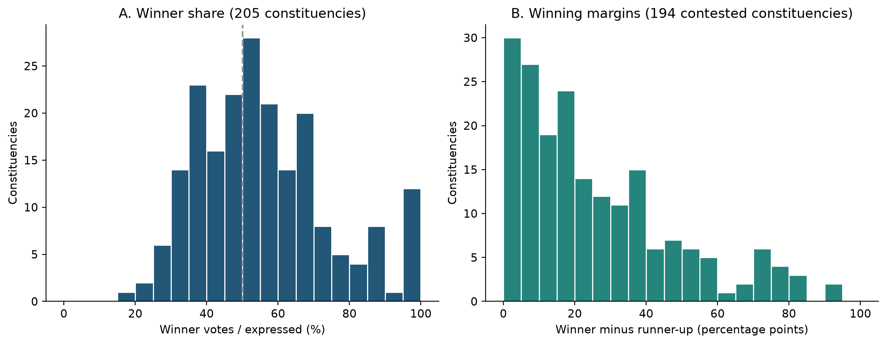

# Retrieval-Augmented Text-to-SQL for Electoral Data

## A data-quality study and preliminary retrieval evaluation

**Deep Learning with Python | Course project 2026**

**Jasen | 27 September 2026**

### 1. Project overview

Answering electoral questions requires more than retrieving a plausible passage. A system must identify the right constituency, interpret the requested metric, calculate at the correct aggregation level and acknowledge information that is absent. This project implements a French-language assistant over a supplied Côte d'Ivoire 2025 election-results PDF. A pretrained Gemini model generates validated, read-only DuckDB queries, supported by lexical or neural retrieval of schema, metric and entity cards.

**Research question.** Does selecting relevant context with multilingual neural retrieval improve evidence coverage over BM25, and can bounded additional searches improve structured question answering under a fixed generation policy?

**Scope.** The project uses a pretrained Hugging Face multilingual E5 encoder and a hosted pretrained generator. Neither is trained or fine-tuned here. The project adopts an evaluation-focused scope; learning rate, optimizer and training epochs are therefore not applicable. The benchmark split separates evaluation questions, not model-training records.

### Contributions and evidence

| Contribution | Evidence available |
|---|---|
| Audited PDF-to-CSV ingestion | 1,125 entries; 205 constituencies; 21 integrity checks pass |
| Exploratory data analysis | Raw/ingested comparison, distributions, aggregation effects, competition and source-checked extremes |
| Functional retrieval-augmented SQL system | 300 cards; BM25, E5, hybrid and bounded-search modes; source inspection in Streamlit |
| Reproducible evaluation | 20 development and 60 test questions drafted; saved contexts, SQL, results, timings and tokens |
| Executed verification | 94 regression tests pass; six live checks on three development questions succeed |

**Main finding.** Data semantics are central: correct national turnout is 35.04%, whereas aggregating repeated candidate rows produces 29.45%. On 18 development questions with annotated evidence slots, E5 retrieves a complete context for 17 questions, compared with 11 for BM25 and 16 for hybrid retrieval. These annotations are unreviewed. The six successful live checks establish integration, not held-out accuracy or superiority of one method.

*Evidence cutoff: 27 September 2026. The 60-question test split has not been evaluated with the live model.*

<!-- pagebreak -->

## 2. Data source, audit and preprocessing

### Source and analytical units

The supplied 35-page PDF identifies the election of deputies to the National Assembly on 27 December 2025. Its transcription contains 16 business fields and three provenance fields: page, table and row. It describes one supplied snapshot; external publisher authentication and later revisions are outside this analysis.

- **Candidate/list entry:** 1,125 rows, keyed by constituency, party/grouping and candidate/list label. A candidature can represent a list, not necessarily one person.
- **Constituency:** 205 IDs, preserved as strings `001` through `205`. Registrations, turnout and ballot totals repeat across candidate rows.
- **Source region/district:** 33 labels, including autonomous districts. The 43 party/grouping labels include coalitions and pooled independent entries.

### Repairing the extraction

Vertical region text, merged cells, shaded backgrounds and page-spanning constituency blocks defeated default table extraction. The original audit counted 1,124 rows and 204 constituency IDs. The repaired extractor ignores misleading shaded rectangles, reconstructs vertical labels, closes missing bottom rules and carries unresolved constituency context across page breaks. It recovers constituency 115 and one omitted candidate/list entry.

No substantive values were imputed or winsorized. A fresh extraction reproduces all **21,375 CSV cells** after type conversion. There are no missing business values, duplicate natural keys or inconsistent repeated constituency totals. This is a reproducibility check using the same extractor, complemented by accounting checks and selected visual source inspection; it is not independent manual transcription of every cell.

### National reconciliation

| Measure | Printed PDF | Correct CSV aggregation | Difference |
|---|---|---|---|
| Registered voters | 8,597,092 | 8,597,092 | 0 |
| Voters | 3,012,094 | 3,012,094 | 0 |
| Polling stations | 25,338 | 25,338 | 0 |
| Invalid ballots | 68,525 | 68,525 | 0 |
| Expressed ballots | 2,943,569 | 2,943,569 | 0 |
| Blank ballots | 29,578 | 29,578 | 0 |
| Candidate/list votes | 2,913,991 | 2,913,991 | 0 |

Within every constituency, voters = invalid + expressed, and candidate votes = expressed - blank. Thus, **expressed ballots include blank ballots in this source**. Source percentage rounding agrees with recomputed ratios within 0.0051 percentage points. All 21 integrity checks pass. The database exposes separate constituency, candidature and elected-row views to preserve these units.

*Sources: EDA national_reconciliation.csv and quality_checks.csv; audit resolution; full EDA supplied separately.*

<!-- pagebreak -->

## 3. EDA: aggregation, distributions and regional variation

### The aggregation level changes the answer

National turnout is `SUM(votants) / SUM(inscrits)` over unique constituencies: **35.04%**. The equal-weight mean of constituency turnout is **42.22%**, a different statistic. Directly summing constituency totals repeated across candidate rows inflates registrations by **5.79 times** and incorrectly yields **29.45%** turnout. The number of entries varies, so numerator and denominator are not inflated equally.

*Figure 1. Correct voter-weighted turnout, the mean constituency rate and an intentionally invalid candidate-row aggregation. Reproduced from the EDA tables; all 205 constituencies.*

| Variable and unit | Median | Minimum | Maximum |
|---|---|---|---|
| Registered voters / constituency | 28,375 | 7,903 | 555,901 |
| Turnout / constituency | 38.43% | 10.11% | 99.98% |
| Entries / constituency | 5 | 1 | 17 |
| Votes / candidate-list entry | 730 | 4 | 141,884 |

The ten largest constituencies contain **27.80% of registrations**. Unequal sizes explain why equally weighting constituencies answers a different question from weighting voters. The turnout interquartile range is 29.31%-51.95%. At source region/district level, weighted turnout ranges from **18.88% in District Autonome d'Abidjan** to **79.14% in Poro**.

### Implications for the assistant

- Voter, registration and ballot totals must use the constituency view; candidate scores use the candidature view.
- “Average turnout” needs an explicit definition. Gold answers distinguish weighted turnout from the mean constituency rate.
- Percentage columns are stored as fractions. Display percentages multiply by 100 once; comparisons such as “above 50%” use a threshold of 0.5.
- Region filters must preserve source spelling, spaces and accents; retrieval can supply the exact stored label.

*Sources: aggregation_comparison.csv, descriptive_statistics.csv and regions.csv in docs/eda/tables. Ratios are calculated from counts before rounding for display.*

<!-- pagebreak -->

## 4. EDA: competition, associations and unusual observations

### Competition and label interpretation

Eleven constituencies have one recorded entry; the other 194 have at least two. Among the latter, 30 winning margins are below five percentage points of expressed ballots. The closest contest, constituency 122, is decided by **two votes**. Exact count differences must be calculated from votes, not reconstructed from rounded shares.

*Figure 2. Winner vote shares and winning margins. Margins require a runner-up and are undefined for the 11 one-entry constituencies. Reproduced from the EDA constituency table.*

RHDP-labelled entries receive **62.59% of nonblank candidate votes** and account for **155 of 205 elected rows**. These are constituency wins, not parliamentary seat counts. `INDEPENDANT` pools 654 separate entries and is not a single organization. Coalitions remain distinct. There are 1,074 distinct candidate/list strings; 18 strings recur across constituencies, so a name alone is not a reliable identity key.

### Associations and source-checked extremes

Spearman correlations with turnout are **-0.552 for electorate size** and **-0.530 for entry count**. These are descriptive constituency-level associations. They do not establish individual behavior or causality; the data are a complete supplied snapshot, not a probability sample.

| Observation | Source evidence | Treatment |
|---|---|---|
| Adzopé, ID 141 | 3,423 invalid / 12,179 voters = 28.11%; page 22 | Retained; visually confirmed |
| Odienné, ID 123 | 32,116 voters / 32,124 registered = 99.98%; page 21 | Retained; visually confirmed |
| Closest contest, ID 122 | 1,916 versus 1,914 votes; page 21 | Count-based margin |

Excluding ID 141 only for sensitivity reduces the aggregate invalid-ballot rate from 2.27% to 2.17%. Restricting analysis to the 194 multi-entry constituencies changes weighted turnout from 35.04% to 31.59%, describing a different population. Neither check alters the main dataset. An IQR rule flags 41 variable-level observations across 39 constituencies; flags do not imply misconduct or transcription errors.

*Sources: closest_contests.csv, party_labels.csv, sensitivity.csv and spearman_correlations.csv. Full EDA: nine figures and detailed numerical tables accompany the report.*

<!-- pagebreak -->

## 5. Method and experimental design

### Shared RAG and SQL pipeline

**Question -> retrieve cards -> Gemini JSON/SQL -> validate -> read-only DuckDB -> result table + source context.** If the model requests missing context in F1/F3, bounded retrieval returns additional cards before generation continues. SQL repairs and retrieval searches have separate budgets.

The corpus contains **7 schema, 12 domain and 281 entity cards** (300 total), built from audited views, the metric glossary and data dictionary. Constituency cards retain PDF pages. Retrieved cards guide query construction; they are not themselves proof of a complete national aggregate. Page citations for returned facts are available when SQL selects `source_page`.

| Condition | Context and mechanism |
|---|---|
| A | All 19 schema/domain cards; no entity cards |
| B | BM25 lexical retrieval [1]; accent folding; k1=1.5, b=0.75 |
| C | Pretrained multilingual-e5-small [2]; normalized embeddings, cosine similarity |
| D | Reciprocal rank fusion of B and C [3]; fusion constant 60 |
| F1 / F3 | Configured static retrieval plus at most 1 / 3 model-requested searches |

Static retrieval selects up to **3 schema + 3 domain + 5 entity cards** per question. E5 uses `query:` and `passage:` prefixes, 384-dimensional embeddings, CPU inference and batch size 32; the pinned model accepts up to 512 tokens. Its weights are frozen. Gemini 3.8 Flash uses temperature 0, JSON output, a 30-second request timeout and at most three SQL repairs. Two transient retries are allowed per generation call. SQL execution has a five-second deadline and a maximum 500-row result cap.

### Evaluation setup and tuning status

The benchmark has **20 development + 60 test questions** across ten intent families, including joins, ratios, aliases, ambiguity, unsupported questions and source evidence. Paraphrase families do not cross splits. Gold SQL, expected results and acceptable evidence-card sets are provided, but all records remain draft and the set is not frozen.

- **Retrieval:** slot recall is the fraction of required evidence slots covered by at least one acceptable card. Complete-context rate requires every slot. Mean recall is averaged over questions with nonempty slots.
- **Answer quality:** compare executed values to gold results, with order-aware scoring for rankings and separate abstention outcomes. Executability alone is insufficient.
- **Efficiency:** log tokens, provider calls, searches and elapsed time; answer caching is disabled during experiments.

Entity quotas 3/5/8 are available for development selection. Results here use 5; no final tuned choice was committed. F currently uses hybrid provisionally. All app and evaluation conditions share the same context builder, prompts, validator and execution path.

<!-- pagebreak -->

## 6. Results: preliminary retrieval comparison

The saved retrieval-only run processes all 20 development questions without calling Gemini. **18 questions have nonempty evidence slots**; the two without slots are excluded from coverage averages. Labels are unreviewed; evidence slots can also encode the basis for appropriate abstention. These metrics describe context selection, not numerical answer accuracy.

| Method | Complete contexts | Complete-context rate | Mean slot recall |
|---|---|---|---|
| BM25 (B) | 11 / 18 | 61.1% | 80.1% |
| Multilingual E5 (C) | 17 / 18 | 94.4% | 98.1% |
| Hybrid RRF (D) | 16 / 18 | 88.9% | 94.4% |

*Figure 3. Coverage from the persisted development traces with quotas 3 schema / 3 domain / 5 entity. The 18-question denominator and unreviewed annotations limit interpretation.*

### What the observed differences mean

E5 supplies complete context for six more development questions than BM25 in this run. The result is consistent with semantic retrieval helping vocabulary variation, but the small, unreviewed development set cannot establish generalization. Hybrid fusion does not automatically improve on its best component: combining rankings can move a required card outside a quota.

| Development example | B slot recall | C | D |
|---|---|---|---|
| Winner in Bouaké ville (dev-001) | 0.50 | 1.00 | 0.50 |
| Total votes for independent entries (dev-004) | 0.50 | 1.00 | 1.00 |
| San-Pédro commune results (dev-011) | 0.50 | 1.00 | 0.50 |

The full-schema baseline has no entity cards by design, so entity-slot coverage is not an unbiased measure of its ability to generate correct SQL. Its value must be assessed through live answer correctness. F1/F3 retrieval-only traces cover their initial static context; without a live model requesting searches, they do not measure adaptive retrieval gains. No neural retriever was trained on these questions.

*Source: experiments/runs/rag-integration-retrieval-20260927/retrieval.jsonl. A derived CSV and the chart-generation code accompany this report.*

<!-- pagebreak -->

## 7. Results: live checks, reliability and resource use

### Three development questions, two retrieval modes

The corrected live run uses Gemini 3.8 Flash and compares BM25 (B) with hybrid (D). The three questions were selected as integration checks, not as a representative accuracy sample. Both methods return the expected result for all three questions.

| Check | Expected and returned result | B | D |
|---|---|---|---|
| Poro total voters, dev-003 | 291,906 | Correct | Correct |
| Haut-Sassandra turnout, dev-012 | 0.2955082439 (29.55%) | Correct | Correct |
| Yamoussoukro commune, dev-019 | Constituency 053; PDF page 10 | Correct | Correct |

| Logged metric (final scored attempts) | BM25 B | Hybrid D |
|---|---|---|
| Correct / evaluated | 3 / 3 | 3 / 3 |
| Median elapsed time | 20.89 s | 18.95 s |
| Mean input tokens | 2,276 | 2,377 |
| Mean output tokens, including reasoning | 1,180 | 1,179 |
| Mean provider calls / question | 2.00 | 1.33 |
| SQL repairs / additional searches | 0 / 0 | 0 / 0 |

Elapsed time includes pacing waits and transient retries. The initial invocation used 12-second pacing; the resumed invocation used 15 seconds. These timings do not support a speed ranking. Token sums come from successful responses; failed-request token use is not established. The scored latest attempts total 10 calls, while the corrected run used **11 calls across resumptions**, including a superseded failed attempt. No monetary cost estimate is reported because billing and dated prices were not audited.

### A live test exposed a real interface defect

Gemini's SDK returned typed text blocks while the agent expected a string. The initial eight-call smoke run therefore attempted unnecessary JSON repairs. Parsing now extracts public answer text from supported blocks, with a regression test. Transient provider failures are recorded separately from SQL and retrieval failures; a budget refusal is no longer counted as a provider call. The original failure traces remain available.

### Engineering verification is separate from model evaluation

- **94 automated tests pass:** ingestion, SQL boundaries, retrieval, evaluation integration, SDK parsing, cache behavior and Streamlit flows.
- **18/18 scripted checks pass:** three questions across six conditions with a fake model returning gold answers. This only verifies the harness.
- **No held-out live evaluation:** the 60 test questions remain unreviewed/unfrozen. Live A/C/F1/F3 quality and live abstention quality have not been established.

Six successes on three questions cannot justify a claim of 100% general accuracy. Degenerate bootstrap intervals from this all-success tiny sample are omitted because they would convey misleading certainty.

*Source: rag-integration-live-fixed-20260927 traces and generated summary; RAG_VERIFICATION_2026-09-27.md.*

<!-- pagebreak -->

## 8. Discussion, conclusion and reproducibility

### Interpretation and limitations

The strongest evidence concerns data quality and a functioning end-to-end system. Repaired extraction and explicit metric definitions remove documented sources of error before retrieval is compared. Preliminary coverage favors E5 over BM25 on the annotated development questions; the current evidence does not show that adaptive retrieval improves final answers. With only three database views, full-schema prompting remains a credible competing approach.

The principal limitations are unreviewed gold labels, a small selected live sample, one election snapshot, no external source authentication, ambiguous candidate/list identities and absent seat/demographic data. Source-consistent outliers do not explain electoral behavior. SQL validation restricts execution but cannot guarantee semantic correctness. The hosted generator sends questions and selected context to the provider; the system is not fully local. Model/API changes, retries and pacing also affect reproducibility and timing.

### Next controlled experiment

1. Review the draft gold results and evidence slots against source pages, then freeze the benchmark before test evaluation.
2. Select the static retriever and entity quota on development data only. Keep the generator, SQL policy and repair budget fixed.
3. Compare A/B/C/D/F1/F3 on the frozen set, subject to an explicit API budget. Report unsupported and ambiguous questions separately.
4. Analyze paired correctness by paraphrase family, context omissions, semantic errors, retries and total cost across resumed attempts. Evaluate caching in a separate repeated-query workload.

**Conclusion.** The project delivers audited structured data, an EDA-driven semantic layer and an operational retrieval-augmented SQL assistant. Local neural retrieval improves provisional development evidence coverage; live checks confirm working integration. A reviewed, held-out experiment is still required to establish answer-quality gains and the value of adaptive search.

### Reproducibility and supplementary material

Python 3.14.4 on macOS arm64; pretrained E5 inference uses CPU. Install `requirements-retrieval.txt`, then run `python -m src.analysis.eda`, `python -m src.retrieval.cli prepare` and `python -m pytest -q`. Evaluation commands and limits are in `docs/RAG.md`. Run manifests record data/corpus hashes, configuration, versions and prompts through fingerprints. Source revision is recorded with a dirty working tree; submission should retain this complete code snapshot. AI assistants supported implementation and drafting; executable checks and saved traces support the reported claims.

The full EDA is `docs/eda/EDA_REPORT.md` with nine figures, detailed CSV tables and hashes. Report source and derived result tables are in `docs/report/`. Live/retrieval traces are under `experiments/runs/rag-integration-*20260927/`. The PDF source and corrected CSV are retained in `dataset/`.

### References

[1] Robertson, S. and Zaragoza, H. (2009). *The Probabilistic Relevance Framework: BM25 and Beyond*. Foundations and Trends in Information Retrieval, 3(4), 333-389. [Author-hosted paper](https://www.staff.city.ac.uk/~sbrp622/papers/foundations_bm25_review.pdf).

[2] Wang, L. et al. (2024). *Multilingual E5 Text Embeddings: A Technical Report*. [arXiv:2402.05672](https://arxiv.org/abs/2402.05672). Model: `intfloat/multilingual-e5-small`, revision `614241f622f53c4eeff9890bdc4f31cfecc418b3`.

[3] Cormack, G. V., Clarke, C. L. A. and Büttcher, S. (2009). *Reciprocal Rank Fusion Outperforms Condorcet and Individual Rank Learning Methods*. SIGIR. [Author-hosted paper](https://cormack.uwaterloo.ca/cormack/cormacksigir09-rrf.pdf).
