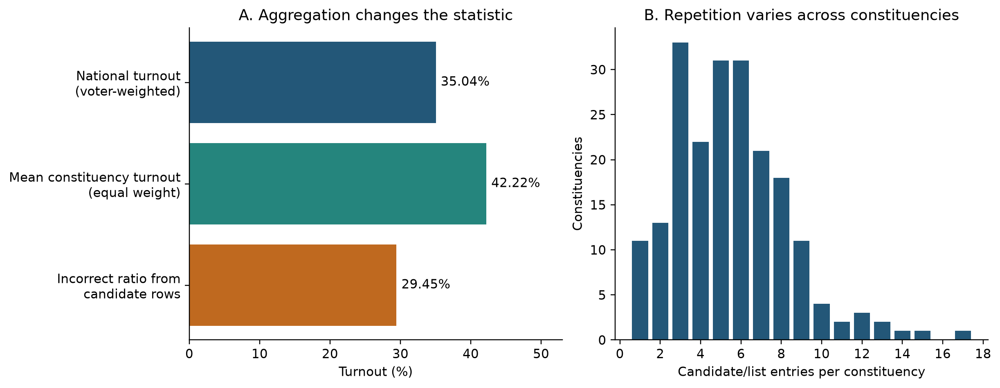
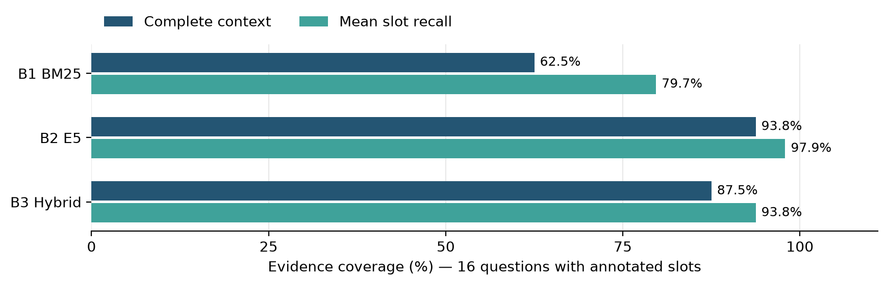

# Evaluating Retrieval Augmentation for Electoral Text to SQL

**Deep Learning with Python | Technical project summary**

**Author:** Zapfack Jasen Steve  
**Instructor:** Benoit Mialet  
**Report date:** 30 September 2026 | **Study:** local validation

## 1 Project overview

I built a French-language assistant for the supplied Côte d'Ivoire 2025 election results. It translates questions into SQL, computes answers in a database and displays results in Streamlit. This study implements a fixed-context versus retrieval comparison, evaluates retrieval locally and verifies the SQL pipeline.

### Problem and motivation

Natural-language access makes complex electoral tables easier to explore. Reliable answers require the correct place, aggregation and denominator, and recognition of missing data.

- **Aggregation:** constituency totals repeat across candidate rows. Summing at the wrong level produces 29.45% turnout instead of 35.04%.
- **Language:** French questions contain paraphrases, accents and aliases that differ from database labels.
- **Reliability:** SQL can execute successfully and still answer the wrong question. Missing demographic or historical data must not be invented.

### Research questions

1. Does text-to-SQL benefit from retrieval augmentation over a fixed-context baseline?
2. Which search method supplies the required context most reliably: BM25, multilingual E5 or hybrid retrieval?
3. How can result correctness, execution and appropriate abstention be evaluated separately?

**A** denotes text-to-SQL without retrieval. **B** is the RAG family: **B1 BM25**, **B2 E5** and **B3 hybrid**. They share the generator interface, prompt, six SQL examples, database and execution rules.

### Main findings and scope

- E5 supplies complete annotated context for **15/16** eligible questions, versus **10/16** for BM25 and **14/16** for hybrid retrieval.
- All **72 scripted pipeline trials** pass, including 56 executions of prepared reference SQL. These validate implementation, not a model's ability to generate SQL.
- **New real-generation accuracy is unmeasured in all four conditions.** Local retrieval findings cannot establish that RAG improves final answers over A.

The study uses pretrained models without training or fine-tuning. It covers 18 predeclared development questions with draft reference labels; the 60 held-out questions remain unevaluated.

<!-- pagebreak -->

## 2 Dataset preprocessing and essential EDA

### Dataset and observation units

The supplied 35-page PDF describes Côte d'Ivoire's election of deputies on 27 December 2025. The CSV contains **1,125 candidate/list entries, 205 constituencies, 33 extracted region/district labels and 43 party/grouping labels**, with 16 business columns and three provenance columns for PDF page, table and row.

A record may represent a list. Winning rows count constituency wins, not seats. Gender labels, list-member rosters and historical series are absent. The publisher has not been independently authenticated.

### Preprocessing and validation

- Reconstruct merged constituency cells and vertical region labels; carry context across pages and recover omitted rows.
- Preserve three-character constituency IDs, accents and source labels; parse counts, percentages and election markers into explicit types.
- Separate candidature, constituency and elected-row database views to avoid multiplying constituency totals by candidate counts.
- Retain unusual source values with their provenance rather than replacing extremes with invented values.

All **21 structural checks pass**. Fresh extraction reproduces the CSV/Parquet, and seven printed national totals reconcile. These checks establish extraction reproducibility, not certainty about geographic interpretation.

### EDA findings that affect the task

| Finding | Observation | Consequence |
|---|---|---|
| Unequal sizes | 7,903 to 555,901 registrations; median 28,375 | Specify aggregation weights |
| Different turnout measures | National 35.04%; constituency mean 42.22% | Define the unit and denominator |
| Unequal competition | 1 to 17 entries; 11 single-entry constituencies | Margins need a runner-up |
| Source extremes | Adzopé invalid rate 28.11%; Odienné turnout 99.98% | Document unusual values |

*Figure 1. National turnout uses one row per constituency: 3,012,094 voters divided by 8,597,092 registered voters. Repeated candidate rows distort the ratio.*

A pre-run audit found ambiguous region carry-forward on **PDF page 14**, affecting IDs 073–077. A hypothetical reassignment changes references for dev-006 and dev-007; both were excluded before inspecting model outcomes. The source issue remains unresolved: matching national totals does not settle regional membership.

<!-- pagebreak -->

## 3 Method models and comparison conditions

### Shared text-to-SQL pipeline

1. Construct context according to A, B1, B2 or B3.
2. Supply the French question, context, shared instructions and six SQL examples to the generator.
3. Receive structured JSON containing SQL, a clarification request or an unsupported-data response.
4. Validate read-only SQL against approved DuckDB views; execute it and return the result table.
5. Score the returned values or the prescribed non-answer against the reference.

**Retrieval-Augmented Generation (RAG)** selects external information before generation. Here, retrieval supplies definitions and labels; SQL calculates. Local validation uses scripted generator outputs to exercise the connecting code.

### A versus the three RAG variants

| Condition | Context supplied | Cards selected | New generation accuracy |
|---|---|---|---|
| A — no retrieval | All schema/domain cards; no entity search | 19 fixed | Not measured |
| B1 — BM25 | Lexical retrieval | 2–11 in this run | Not measured |
| B2 — E5 | Neural semantic retrieval | 11 | Not measured |
| B3 — hybrid | Fusion of lexical/neural rankings | 11 | Not measured |

B1/B2/B3 share a maximum of **3 schema + 3 domain + 5 entity cards**. BM25 drops zero-score matches. A retains database knowledge with fixed context. An A-to-B comparison changes context size, entity information and selection; B1/B2/B3 share quotas.

### Corpus and models

- **Corpus:** 300 short reference cards: 7 schema, 12 domain and 281 entity cards. Entity cards cover 205 constituencies, 33 regions/districts and 43 parties/groupings.
- **BM25 [1]:** term-based ranking with French accent normalization.
- **Multilingual E5 small [2]:** a pretrained local encoder creates embeddings, numerical text representations used for similarity ranking. E5 does not generate SQL.
- **Hybrid RRF [3]:** reciprocal rank fusion combines the BM25 and E5 rank positions.
- **Generator configuration:** gemini-3.8-flash. No successful generator response is part of this new comparison, so no provider-reported model version or generation score is inferred.

The application uses local NumPy embedding caches and an exact-question response cache. Evaluation bypasses the response cache. Adaptive-search variants are outside this four-condition study.

<!-- pagebreak -->

## 4 Evaluation setup and hyperparameters

### Training development and test split

Pretrained weights remain frozen. There is **no training split, optimizer, learning rate or epoch schedule**, because the project evaluates inference rather than training.

- **20 development questions:** inspected during development; dev-006/007 are excluded because their references depend on the source ambiguity.
- **18 retained questions:** 14 answerable, 2 ambiguous and 2 unsupported. Four conditions yield 72 planned generation trials; the local run exercises them with scripted outputs.
- **60 held-out questions:** reserved for later evaluation. Paraphrase families do not cross the development/test split.

All 80 records remain draft. The 16 answerable development reference queries agree with independent CSV calculations. The two exclusions are database-consistent but sensitive to regional assignment. Human source review remains necessary.

### Fixed comparison protocol

Questions, exclusions, metrics and context settings were declared before outcome inspection. Interleaved conditions share the generator configuration, prompt, examples, validator and repair policy. No item is excluded because of its outcome.

| Setting | Value | Purpose |
|---|---|---|
| RAG quotas | 3 schema + 3 domain + 5 entity | Shared context budget |
| BM25 | k1 = 1.5; b = 0.75 | Term and length weighting |
| E5 | 384 dimensions; normalized vectors; batch 32; CPU | Semantic ranking |
| E5 input | query: / passage: prefixes; maximum 512 tokens | Encoder format |
| Hybrid | RRF constant = 60 | Rank fusion |
| Generator configuration | Temperature 0; JSON; 30 s request timeout | Shared future generation setting |
| Recovery and SQL | 3 repairs; 2 transient retries; 5 s SQL timeout; 500-row limit | Bound recovery/execution |

### Hyperparameter exploration

The local retrieval run checks entity quotas **3, 5 and 8**, holding schema/domain quotas at 3 each. All three settings give identical annotated coverage for each method on this sample. The report uses quota 5; no optimal value or tuning improvement is established. BM25 parameters, E5 weights and the RRF constant are unchanged.

Manifests preserve source/configuration fingerprints and the E5 revision. Traces record context, SQL, values and outcomes; a ledger separates attempted calls from successful responses. Unrun trials are not model failures.

<!-- pagebreak -->

## 5 Local retrieval results and interpretation

### What the metrics mean

An **evidence slot** is a requirement, such as the correct table, rule or place label. Alternative cards may satisfy it. Finding two of three slots gives 66.7% recall but incomplete context.

- **Mean slot recall:** average fraction of required slots covered per question.
- **Complete-context rate:** fraction of questions for which every slot is covered.
- **Recall@5:** slot recall within the first five results of the global ranking.
- **Slot-based nDCG@5:** normalized discounted cumulative gain; rewards new evidence appearing early in the ranking.

**16 of 18 questions have evidence slots**, including two unsupported requests. The two ambiguous questions have none and are excluded from retrieval averages. This differs from the 14-question SQL denominator.

### Context selected under the shared quotas

| Method | Complete contexts | Complete-context rate | Mean slot recall |
|---|---|---|---|
| B1 — BM25 | 10 / 16 | 62.5% | 79.7% |
| B2 — E5 | 15 / 16 | 93.8% | 97.9% |
| B3 — hybrid | 14 / 16 | 87.5% | 93.8% |

*Table 1. Coverage after per-type selection with quotas 3/3/5. This measures available context, not generated-answer accuracy; reference annotations remain draft.*

*Figure 2. E5 covers all requirements for five more questions than BM25 and one more than hybrid retrieval in this local development run.*

### Global ranking gives a different diagnostic

| Method | Recall@5 | nDCG@5 | Complete within top 5 |
|---|---|---|---|
| B1 — BM25 | 60.4% | 0.623 | 6 / 16 |
| B2 — E5 | 60.9% | 0.617 | 5 / 16 |
| B3 — hybrid | 54.7% | 0.564 | 4 / 16 |

BM25 leads nDCG@5; E5 leads coverage after per-type selection. These assess different outputs: global ranking versus balanced context. Neither establishes SQL correctness. A deliberately omits entity cards, so its slot coverage cannot serve as a generation baseline score.

<!-- pagebreak -->

## 6 SQL validation reliability and observed cases

### Local SQL and scoring checks

The scripted generator returns reference SQL or prescribed non-answers. The shared evaluator validates, executes and scores them.

| Condition | Prepared SQL results correct | Scripted non-answers correct | Pipeline trials passed |
|---|---|---|---|
| A — no retrieval | 14 / 14 | 4 / 4 | 18 / 18 |
| B1 — BM25 | 14 / 14 | 4 / 4 | 18 / 18 |
| B2 — E5 | 14 / 14 | 4 / 4 | 18 / 18 |
| B3 — hybrid | 14 / 14 | 4 / 4 | 18 / 18 |

*Table 2. Software validation only: 56 prepared SQL executions and 16 prescribed non-answers across 72 trials. The scripted answers are known in advance, so these are not model accuracy or hallucination results.*

These checks confirm evaluator/database integration. Regression tests also cover configuration, SQL controls, retrieval, response parsing and scoring. They do not measure unseen-question performance.

### Concrete retrieval observations

- **Bouaké winner, dev-001:** E5 covers 2/2 slots; BM25 and hybrid cover 1/2. No new generated answer tests whether this improves correctness.
- **Gender request, dev-017:** BM25 covers 0/1 slots; E5 and hybrid cover 1/1. This is evidence about missing data, not an observed model abstention.
- **Yamoussoukro source page, dev-019:** BM25 and hybrid cover 3/3 slots; E5 covers 2/3. E5 does not win every question.

### Metrics ready for a real generation comparison

- **Strict SQL-result accuracy:** correct executed result on an answerable question; planned denominator 14. Values, tolerances and ordering are checked rather than exact SQL wording.
- **Overall task success:** correct SQL result or prescribed non-answer; planned denominator 18.
- **Execution rate:** SQL ran successfully on an answerable item; this alone does not establish correctness.
- **Appropriate non-answer:** clarification for ambiguity or abstention for unsupported data; four cases. Unsupported answers are counted separately.
- **Repairs, latency and tokens:** operational measures to record alongside accuracy; none is a new real-generator measurement here.

Earlier checks on 27 September returned correct live results for three selected questions in BM25 and hybrid modes. They established API integration on six trials, not the four-condition comparison above.

<!-- pagebreak -->

## 7 Discussion and short conclusion

### Meaning of the findings

E5 supplies the most complete annotated context under these quotas. This supports further semantic-retrieval evaluation. Global-ranking scores show that selection policy matters: the best top-five ranking need not produce the best balanced context.

**Whether RAG improves SQL accuracy over A remains unanswered.** A model can succeed with fixed schema, ignore relevant evidence or calculate incorrectly despite complete context. Generated queries on matched questions are needed.

### What worked and what did not

- **Worked:** all configurations pass local pipeline checks; prepared SQL matches reference values and retrieval diagnostics are reproducible.
- **Incomplete evidence:** BM25 misses slots on six questions, E5 on one and hybrid on two. Partial recall can hide a critical gap.
- **Unexpected:** hybrid does not exceed E5's complete-context coverage, and increasing the entity quota from 3 to 8 does not improve coverage here.
- **Data lesson:** matching totals and reproducible extraction can coexist with ambiguous regional assignments. Source interpretation must precede scoring.

### Limitations

- **No generator comparison:** new SQL accuracy, real abstention, token usage and model latency remain unmeasured.
- **Draft benchmark:** automated checks cannot replace independent review. Labels and acceptable evidence may be incomplete.
- **Small sample:** 18 development questions, 16 evidence-labeled and 14 answerable; these are not held-out findings.
- **Context design:** A supplies 19 fixed cards; RAG uses up to 11 selected cards with entities. An eventual difference would combine selection, content and context size.
- **Scope:** one election snapshot, unresolved regional ambiguity and one encoder. No fine-tuning or adaptive-search gain is evaluated.

### Improvements with more time

1. Resolve the source ambiguity and independently review reference SQL, answerability and evidence labels.
2. Run actual generation for all conditions on the same questions; inspect disagreements and distinguish missing context, semantic SQL mistakes and provider failures.
3. Select settings using development data, then evaluate the untouched test set with repeated inference and paired uncertainty estimates.
4. Isolate card count, domain rules and entity information through controlled ablations; then consider reranking or adaptive search.

### Conclusion

The project delivers an electoral assistant and locally validated comparison framework. E5 leads selected-context coverage, and all configurations pass scripted checks. A future generation comparison must determine whether this improves SQL accuracy; neither RAG benefit nor freedom from hallucination is established.

<!-- pagebreak -->

## Appendix Terms references and reproducibility

### Short glossary

| Term | Meaning in this project |
|---|---|
| Text to SQL | Convert a natural-language question into a database query |
| LLM and inference | Large language model; inference uses existing weights to generate output |
| RAG | Retrieve external context before asking the model to generate |
| Corpus and card | Complete reference collection; one short reference document |
| Schema domain and entity | Database structure; calculation rules; places or party labels |
| Embedding and encoder | Numerical text representation; model that computes it |
| Baseline and ablation | Reference approach; controlled change/removal of a component |
| Gold result | Expected reference answer used for scoring; still needs validation |
| Abstention and clarification | State that data cannot answer; ask the user to resolve ambiguity |
| Scripted generator | Test substitute that returns prepared outputs instead of model predictions |

### References

[1] Robertson, S. and Zaragoza, H. (2009). *The Probabilistic Relevance Framework: BM25 and Beyond*. Foundations and Trends in Information Retrieval, 3(4), 333-389. https://doi.org/10.1561/1500000019

[2] Wang, L. et al. (2024). *Multilingual E5 Text Embeddings: A Technical Report*. https://arxiv.org/abs/2402.05672

[3] Cormack, G. V., Clarke, C. L. A. and Büttcher, S. (2009). *Reciprocal Rank Fusion Outperforms Condorcet and Individual Rank Learning Methods*. SIGIR. https://cormack.uwaterloo.ca/cormack/cormacksigir09-rrf.pdf

### Reproducibility and supplementary material

- **Protocol:** configs/text_to_sql_comparison.json. A/B1/B2/B3 map to internal A/B/C/D; B denotes the RAG family.
- **Audit:** docs/evaluation/comparison_preflight_2026-09-30.json records input hashes, independent reference checks and pre-run exclusions.
- **Retrieval traces:** experiments/runs/text-to-sql-comparison-retrieval-20260930/retrieval.jsonl.
- **Scripted validation:** experiments/runs/text-to-sql-comparison-preflight-20260930/traces.jsonl. Earlier integration checks are documented in docs/RAG_VERIFICATION_2026-09-27.md.
- **Data and EDA:** supplied PDF and corrected CSV/Parquet/DuckDB in dataset/. Full EDA and supplementary figures: docs/eda/EDA_REPORT.md.
- **Environment:** Python 3.14.4, macOS arm64; E5 on CPU. Encoder intfloat/multilingual-e5-small, revision 614241f622f53c4eeff9890bdc4f31cfecc418b3. Requirements and manifests record dependencies.
- **Entry point:** python -m src.evaluation.compare_rag supports retrieval-only, fake and live modes; live requires a call cap.

The app and evaluator share the context builder and SQL pipeline. Source files accompany the report. AI assistants supported implementation and writing; findings are tied to saved local traces and explicit scoring rules.
