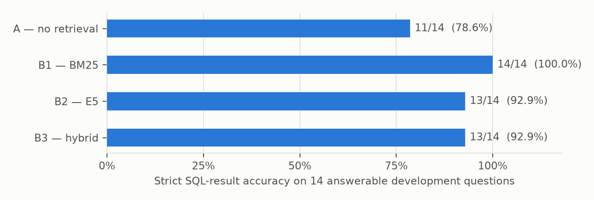

# Evaluating Retrieval Augmentation for Electoral Text to SQL

**Deep Learning with Python | Technical project summary**

**Author:** Zapfack Jasen Steve  
**Instructor:** Benoit Mialet  
**Report date:** 30 September 2026 | **Study:** development-split generation comparison

## 1 Project overview

I built a French-language assistant for the supplied Côte d'Ivoire 2025 election results. It translates questions into SQL, computes answers in a database and displays results in Streamlit. This study compares text-to-SQL with a fixed context against three retrieval-augmented variants, first by the context they supply and then by the SQL results a real language model generates with that context.

### Problem and motivation

Natural-language access makes complex electoral tables easier to explore. Reliable answers require the correct place, aggregation and denominator, and recognition of missing data.

- **Aggregation:** constituency totals repeat across candidate rows. Summing at the wrong level produces 29.45% turnout instead of 35.04%.
- **Language:** French questions contain paraphrases, accents and aliases that differ from database labels.
- **Reliability:** SQL can execute successfully and still answer the wrong question. Missing demographic or historical data must not be invented.

### Research questions

1. Does text-to-SQL benefit from retrieval augmentation over a fixed-context baseline?
2. Which search method supplies the required context most reliably: BM25, multilingual E5 or hybrid retrieval?
3. How can result correctness, execution and appropriate abstention be evaluated separately?

**A** denotes text-to-SQL without retrieval. **B** is the RAG family: **B1 BM25**, **B2 E5** and **B3 hybrid**. They share the generator, prompt, six SQL examples, database and execution rules.

### Main findings and scope

- With **Claude Haiku 4.5** generating SQL, strict SQL-result accuracy on the 14 answerable development questions is **A 11/14 (78.6%)**, **B1 14/14 (100%)**, **B2 13/14 (92.9%)** and **B3 13/14 (92.9%)**.
- Paired against A, B1 wins 3 questions and loses 0, B2 wins 2 and loses 0, and B3 wins 3 and loses 1. Exact McNemar p-values are 0.25, 0.50 and 0.625: **no difference is statistically established** at this sample size.
- A's three errors all involve place names absent from its fixed context: an accented spelling, a hyphenated spelling and an under-specified name match. This is the information that RAG entity cards supply.
- E5 supplies complete annotated context for **15/16** eligible questions, versus **10/16** for BM25 and **14/16** for hybrid retrieval.

The study uses pretrained models without training or fine-tuning. It covers 18 predeclared development questions with draft reference labels and one run per condition; the 60 held-out questions remain unevaluated.

<!-- pagebreak -->

## 2 Dataset preprocessing and essential EDA

### Dataset and observation units

The supplied 35-page PDF describes Côte d'Ivoire's election of deputies on 27 December 2025. The CSV contains **1,125 candidate/list entries, 205 constituencies, 33 extracted region/district labels and 43 party/grouping labels**, with 16 business columns and three provenance columns for PDF page, table and row.

A record may represent a list. Winning rows count constituency wins, not seats. Gender labels, list-member rosters and historical series are absent. The publisher has not been independently authenticated.

### Preprocessing and validation

- Reconstruct merged constituency cells and vertical region labels; carry context across pages and recover omitted rows.
- Preserve three-character constituency IDs, accents and source labels; parse counts, percentages and election markers into explicit types.
- Separate candidature, constituency and elected-row database views to avoid multiplying constituency totals by candidate counts.
- Retain unusual source values with their provenance rather than replacing extremes with invented values.

All **21 structural checks pass**. Fresh extraction reproduces the CSV/Parquet, and seven printed national totals reconcile. These checks establish extraction reproducibility, not certainty about geographic interpretation.

### EDA findings that affect the task

| Finding | Observation | Consequence |
|---|---|---|
| Unequal sizes | 7,903 to 555,901 registrations; median 28,375 | Specify aggregation weights |
| Different turnout measures | National 35.04%; constituency mean 42.22% | Define the unit and denominator |
| Unequal competition | 1 to 17 entries; 11 single-entry constituencies | Margins need a runner-up |
| Source extremes | Adzopé invalid rate 28.11%; Odienné turnout 99.98% | Document unusual values |

*Figure 1. National turnout uses one row per constituency: 3,012,094 voters divided by 8,597,092 registered voters. Repeated candidate rows distort the ratio.*

A pre-run audit found ambiguous region carry-forward on **PDF page 14**, affecting IDs 073–077. A hypothetical reassignment changes references for dev-006 and dev-007; both were excluded before any model outcome existed. The source issue remains unresolved: matching national totals does not settle regional membership.

<!-- pagebreak -->

## 3 Method models and comparison conditions

### Shared text-to-SQL pipeline

1. Construct context according to A, B1, B2 or B3.
2. Supply the French question, context, shared instructions and six SQL examples to the generator.
3. Receive structured JSON containing SQL, a clarification request or an unsupported-data response.
4. Validate read-only SQL against approved DuckDB views; execute it and return the result table.
5. Score the returned values or the prescribed non-answer against the reference.

**Retrieval-Augmented Generation (RAG)** selects external information before generation. Here, retrieval supplies definitions and labels; SQL calculates.

### A versus the three RAG variants

| Condition | Context supplied | Cards selected | SQL-result accuracy |
|---|---|---|---|
| A — no retrieval | All schema/domain cards; no entity search | 19 fixed | 11 / 14 |
| B1 — BM25 | Lexical retrieval | 2–11 in this run | 14 / 14 |
| B2 — E5 | Neural semantic retrieval | 11 | 13 / 14 |
| B3 — hybrid | Fusion of lexical/neural rankings | 11 | 13 / 14 |

B1/B2/B3 share a maximum of **3 schema + 3 domain + 5 entity cards**. BM25 drops zero-score matches. A retains database knowledge with fixed context. An A-to-B comparison changes context size, entity information and selection; B1/B2/B3 share quotas.

### Corpus and models

- **Corpus:** 300 short reference cards: 7 schema, 12 domain and 281 entity cards. Entity cards cover 205 constituencies, 33 regions/districts and 43 parties/groupings.
- **BM25 [1]:** term-based ranking with French accent normalization.
- **Multilingual E5 small [2]:** a pretrained local encoder creates embeddings, numerical text representations used for similarity ranking. E5 does not generate SQL.
- **Hybrid RRF [3]:** reciprocal rank fusion combines the BM25 and E5 rank positions.
- **Generator [4]:** Claude Haiku 4.5 through the Anthropic API (requested as claude-haiku-4-5; provider-reported version claude-haiku-4-5-20251001), temperature 0, with JSON-schema structured output.

**Protocol deviation.** The predeclared protocol named gemini-3.8-flash. All four Gemini attempts failed with network errors and returned no response, so the generator was changed to Claude Haiku 4.5 before any model outcome was observed. Questions, exclusions, prompts, examples, context settings and metrics are unchanged; the benchmark hash matches the pre-run audit.

The application uses local NumPy embedding caches and an exact-question response cache. Evaluation bypasses the response cache. Adaptive-search variants are outside this four-condition study.

<!-- pagebreak -->

## 4 Evaluation setup and hyperparameters

### Training development and test split

Pretrained weights remain frozen. There is **no training split, optimizer, learning rate or epoch schedule**, because the project evaluates inference rather than training.

- **20 development questions:** inspected during development; dev-006/007 are excluded because their references depend on the source ambiguity.
- **18 retained questions:** 14 answerable, 2 ambiguous and 2 unsupported. Four conditions yield 72 generation trials, all completed.
- **60 held-out questions:** reserved for later evaluation. Paraphrase families do not cross the development/test split.

All 80 records remain draft. The 16 answerable development reference queries agree with independent CSV calculations. The two exclusions are database-consistent but sensitive to regional assignment. Human source review remains necessary.

### Fixed comparison protocol

Questions, exclusions, metrics and context settings were declared before outcome inspection. Interleaved conditions share the generator, prompt, examples, validator and repair policy. No item is excluded because of its outcome.

| Setting | Value | Purpose |
|---|---|---|
| RAG quotas | 3 schema + 3 domain + 5 entity | Shared context budget |
| BM25 | k1 = 1.5; b = 0.75 | Term and length weighting |
| E5 | 384 dimensions; normalized vectors; batch 32; CPU | Semantic ranking |
| E5 input | query: / passage: prefixes; maximum 512 tokens | Encoder format |
| Hybrid | RRF constant = 60 | Rank fusion |
| Generator | Haiku 4.5; temperature 0; JSON schema; 60 s timeout | Shared generation setting |
| Recovery and SQL | 3 repairs; 2 transient retries; 5 s SQL timeout; maximum 500 rows | Bound recovery/execution |

### Hyperparameter exploration

The local retrieval run checks entity quotas **3, 5 and 8**, holding schema/domain quotas at 3 each. All three settings give identical annotated coverage for each method on this sample. The report uses quota 5; no optimal value or tuning improvement is established. BM25 parameters, E5 weights and the RRF constant are unchanged.

Manifests preserve source/configuration fingerprints and the E5 revision. Traces record context, SQL, values and outcomes; a provider ledger records every attempted call, including failures.

<!-- pagebreak -->

## 5 Retrieval results and interpretation

### What the metrics mean

An **evidence slot** is a requirement, such as the correct table, rule or place label. Alternative cards may satisfy it. Finding two of three slots gives 66.7% recall but incomplete context.

- **Mean slot recall:** average fraction of required slots covered per question.
- **Complete-context rate:** fraction of questions for which every slot is covered.
- **Recall@5:** slot recall within the first five results of the global ranking.
- **Slot-based nDCG@5:** normalized discounted cumulative gain; rewards new evidence appearing early in the ranking.

**16 of 18 questions have evidence slots**, including two unsupported requests. The two ambiguous questions have none and are excluded from retrieval averages. This differs from the 14-question SQL denominator.

### Context selected under the shared quotas

| Method | Complete contexts | Complete-context rate | Mean slot recall |
|---|---|---|---|
| B1 — BM25 | 10 / 16 | 62.5% | 79.7% |
| B2 — E5 | 15 / 16 | 93.8% | 97.9% |
| B3 — hybrid | 14 / 16 | 87.5% | 93.8% |

*Table 1. Coverage after per-type selection with quotas 3/3/5. The generation run used the same selection settings; card counts match on every trial. Reference annotations remain draft.*

### Global ranking gives a different diagnostic

| Method | Recall@5 | nDCG@5 | Complete within top 5 |
|---|---|---|---|
| B1 — BM25 | 60.4% | 0.623 | 6 / 16 |
| B2 — E5 | 60.9% | 0.617 | 5 / 16 |
| B3 — hybrid | 54.7% | 0.564 | 4 / 16 |

BM25 leads nDCG@5; E5 leads coverage after per-type selection. These assess different outputs: global ranking versus balanced context. A deliberately omits entity cards, so its slot coverage cannot serve as a retrieval score.

**Coverage did not predict accuracy.** BM25 had the least complete context yet the highest SQL-result accuracy. Its six incomplete contexts lacked a view card (four questions), the INDEPENDANT party card or the data-scope rule, and the model answered all six correctly, probably helped by the shared instructions and examples. A's errors instead involved place names absent from its context.

<!-- pagebreak -->

## 6 Generation results

### SQL accuracy and task success

*Figure 2. Strict SQL-result accuracy: a correct executed result on an answerable question, checked by value, tolerance and ordering rather than SQL wording. Claude Haiku 4.5, one run per condition.*

| Condition | SQL-result accuracy | Task success (of 18) [95% CI] | Non-answers correct |
|---|---|---|---|
| A — no retrieval | 11 / 14 (78.6%) | 15 (83.3%) [60.8, 94.2] | 4 / 4 |
| B1 — BM25 | 14 / 14 (100%) | 18 (100%) [82.4, 100] | 4 / 4 |
| B2 — E5 | 13 / 14 (92.9%) | 17 (94.4%) [74.2, 99.0] | 4 / 4 |
| B3 — hybrid | 13 / 14 (92.9%) | 17 (94.4%) [74.2, 99.0] | 4 / 4 |

*Table 2. Task success accepts a correct result or the prescribed clarification/abstention. Intervals are Wilson 95% intervals. Every generated query executed; no condition answered an unsupported question.*

| Comparison with A | Wins | Losses | Exact McNemar p |
|---|---|---|---|
| B1 — BM25 | 3 | 0 | 0.25 |
| B2 — E5 | 2 | 0 | 0.50 |
| B3 — hybrid | 3 | 1 | 0.625 |

*Table 3. Paired strict SQL-result accuracy on the same 14 questions. A win means only the RAG condition was correct. p-values are two-sided and unadjusted for three comparisons.*

### Every error inspected

- **Bouaké winner, dev-001, A:** filtered on 'BOUAKÉ'; the source writes BOUAKE, so the query returned no rows. All RAG conditions were correct.
- **San-Pédro results, dev-011, A:** filtered on 'SAN-PEDRO'; the source writes SAN PEDRO, so no rows. B1 and B3 were correct.
- **San-Pédro results, dev-011, B2:** the name filter also matched a second constituency (173), returning 16 rows instead of 9, although the context was complete.
- **Yamoussoukro source page, dev-019, A:** a loose name match with LIMIT 1 selected constituency 052 and page 9 instead of 053 and page 10.
- **RHDP vote share, dev-010, B3:** a malformed aggregation returned the INDEPENDANT row with 0%, despite complete context.

All three A errors occurred with incomplete context; both RAG errors occurred with complete context and are generation errors.

### Operational measures

- **Calls:** 73 provider calls for 72 trials. One request timed out and succeeded on retry; no SQL repair was needed.
- **Tokens:** mean input 4,516 for A versus 2,644–3,044 for RAG; mean output 84–87 tokens. Totals: 237,673 input and 6,129 output tokens.
- **Cost:** about USD 0.27, estimated from Anthropic list prices of USD 1 / 5 per million input/output tokens, not from an invoice.
- **Latency:** median 1.7–1.9 s per trial, including retrieval and SQL execution.

Before the live run, a scripted generator returning reference answers passed all 72 trials, confirming the evaluator and database integration.

<!-- pagebreak -->

## 7 Discussion and short conclusion

### Meaning of the findings

**RAG was numerically more accurate than A in all three variants, but the evidence is not conclusive.** With 14 answerable questions, one question changes accuracy by about 7 points, and every confidence interval and paired test is compatible with no difference.

The error analysis is more informative than the totals. A failed where exact place spellings mattered, precisely what entity cards supply. RAG also sent 32.6–41.5% fewer input tokens than A. Complete context was not sufficient, however: both RAG errors were semantic mistakes made with every required card present.

### What worked and what did not

- **Worked:** all 72 trials completed and scored; every generated query executed; all ambiguous and unsupported questions received the prescribed non-answer.
- **Retrieval:** E5 gives the most complete context, but BM25's exact place labels were enough for the highest accuracy on this sample.
- **Unexpected:** coverage ranking (E5 > hybrid > BM25) did not match accuracy ranking (BM25 > E5 = hybrid).
- **Data lesson:** matching totals and reproducible extraction can coexist with ambiguous regional assignments. Source interpretation must precede scoring.

### Limitations

- **Development data:** these 18 questions were inspected during development; they are not held-out findings.
- **Draft benchmark:** automated checks cannot replace independent review. Labels and acceptable evidence may be incomplete.
- **Small sample and one run:** 14 answerable questions, one repetition; temperature 0 does not guarantee identical repeated outputs.
- **One generator:** results describe Claude Haiku 4.5, not the originally configured Gemini model or other models.
- **Context design:** A supplies 19 fixed cards; RAG uses up to 11 selected cards with entities. The difference combines selection, content and context size.
- **Scope:** one election snapshot, unresolved regional ambiguity and one encoder. No fine-tuning or adaptive-search gain is evaluated.

### Improvements with more time

1. Resolve the source ambiguity and independently review reference SQL, answerability and evidence labels; then freeze the test set.
2. Run the 60 held-out questions with repeated inference and paired uncertainty estimates.
3. Replicate with a second generator, such as the configured Gemini model, to test whether the pattern holds.
4. Isolate card count, domain rules and entity information through controlled ablations; then consider reranking or adaptive search.

### Conclusion

The project delivers an electoral assistant and a reproducible comparison framework, now with real generated SQL. On the development questions, all three RAG variants answered more questions correctly than text-to-SQL without retrieval, and A's failures were place-name errors that retrieval addresses. The sample is too small to establish a significant benefit; the held-out evaluation must confirm it.

<!-- pagebreak -->

## Appendix Terms references and reproducibility

### Short glossary

| Term | Meaning in this project |
|---|---|
| Text to SQL | Convert a natural-language question into a database query |
| LLM and inference | Large language model; inference uses existing weights to generate output |
| RAG | Retrieve external context before asking the model to generate |
| Corpus and card | Complete reference collection; one short reference document |
| Schema domain and entity | Database structure; calculation rules; places or party labels |
| Embedding and encoder | Numerical text representation; model that computes it |
| Baseline and ablation | Reference approach; controlled change/removal of a component |
| Gold result | Expected reference answer used for scoring; still needs validation |
| Abstention and clarification | State that data cannot answer; ask the user to resolve ambiguity |
| McNemar test | Paired test that uses only questions where exactly one condition is correct |

### References

[1] Robertson, S. and Zaragoza, H. (2009). *The Probabilistic Relevance Framework: BM25 and Beyond*. Foundations and Trends in Information Retrieval, 3(4), 333-389. https://doi.org/10.1561/1500000019

[2] Wang, L. et al. (2024). *Multilingual E5 Text Embeddings: A Technical Report*. https://arxiv.org/abs/2402.05672

[3] Cormack, G. V., Clarke, C. L. A. and Büttcher, S. (2009). *Reciprocal Rank Fusion Outperforms Condorcet and Individual Rank Learning Methods*. SIGIR. https://cormack.uwaterloo.ca/cormack/cormacksigir09-rrf.pdf

[4] Anthropic. *Claude models overview and pricing*. https://docs.anthropic.com/en/docs/about-claude/models

### Reproducibility and supplementary material

- **Protocol:** configs/text_to_sql_comparison.json. A/B1/B2/B3 map to internal A/B/C/D.
- **Audit:** docs/evaluation/comparison_preflight_2026-09-30.json records input hashes, independent reference checks and pre-run exclusions.
- **Generation run:** experiments/runs/text-to-sql-comparison-haiku-20260930 (manifest, traces, provider ledger); full results in experiments/reports/text-to-sql-comparison-haiku-20260930/results.md.
- **Retrieval traces:** experiments/runs/text-to-sql-comparison-retrieval-20260930/retrieval.jsonl.
- **Data and EDA:** supplied PDF and corrected CSV/Parquet/DuckDB in dataset/. Full EDA: docs/eda/EDA_REPORT.md.
- **Environment:** Python 3.14.4, macOS arm64; E5 on CPU, intfloat/multilingual-e5-small revision 614241f622f53c4eeff9890bdc4f31cfecc418b3; anthropic SDK 1.9.0.
- **Command:** python -m src.evaluation.compare_rag --mode live --provider claude --max-calls 300 --pace 1 --run-id text-to-sql-comparison-haiku-20260930, with ANTHROPIC_MODEL=claude-haiku-4-5.

The app and evaluator share the context builder and SQL pipeline. AI assistants supported implementation and writing; findings are tied to saved traces and explicit scoring rules.
