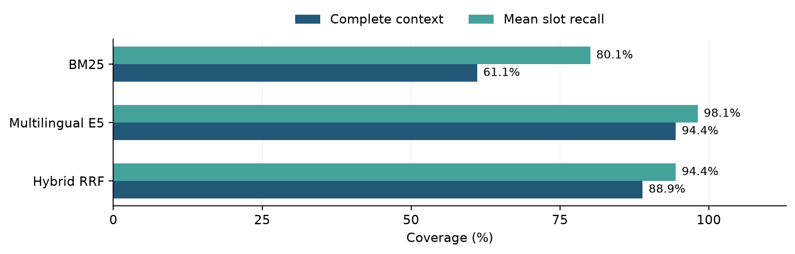

# Evaluating Lexical Neural and Hybrid Retrieval for an Electoral RAG Assistant

**Deep Learning with Python | Technical project summary**

**Author:** Zapfack Jasen Steve  
**Instructor:** Benoit Mialet  
**Report date:** 30 September 2026 | **Experiments:** 27 September 2026

## 1 Project overview

I built a French-language assistant that answers questions about the supplied Côte d'Ivoire 2025 election results. The project combines a local retrieval system, a pretrained language model and a SQL database. It delivers a working Streamlit application and a preliminary comparison of three retrieval methods.

### Problem and motivation

The project grew from a practical interview-style task: make electoral data accessible through natural-language questions. A useful answer requires more than matching a place name. The system must identify the right data, use the correct calculation and avoid answering questions that the source cannot support.

- **Data challenge:** constituency totals repeat across candidate rows. Summing at the wrong level changes national turnout from 35.04% to an incorrect 29.45%.
- **Language challenge:** French questions may use paraphrases, accents or geographical names that differ from the stored labels.
- **Evaluation challenge:** finding relevant information and producing the correct final answer are different achievements and must be measured separately.

### Research questions

1. Which method supplies the required context most reliably: lexical BM25, neural multilingual E5 or their hybrid combination?
2. Does the complete retrieval-to-SQL process return the expected answer on real questions?
3. Can bounded additional searches improve answers? This extension is implemented, but its live benefit remains to be evaluated.

### Main findings and scope

- E5 retrieves complete reference context for **17/18** annotated development questions, versus **11/18** for BM25 and **16/18** for hybrid retrieval.
- BM25 and hybrid each answer **three selected live questions correctly**, giving six successful integration checks.
- **94 automated tests pass**, covering software behavior; this is not a count of correctly answered benchmark questions.

The contribution is an **evaluation-focused NLP system using pretrained models**. No model is trained or fine-tuned. The live evaluation is a pilot: reference labels remain unreviewed and the 60-question held-out test set has not been evaluated with Gemini.

<!-- pagebreak -->

## 2 Dataset preprocessing and essential EDA

### Dataset and units of observation

The source is a supplied 35-page PDF describing the election of deputies to Côte d'Ivoire's National Assembly on 27 December 2025. The corrected CSV contains **1,125 candidate/list entries, 205 constituencies, 33 source region/district labels and 43 party/grouping labels**. It has 16 business columns and three provenance columns identifying PDF page, table and row.

A row can represent a list rather than one person. Counts of elected rows describe constituency wins, not parliamentary seats. The snapshot contains no demographic variables, list-member roster or historical election series.

### Preprocessing and validation

- Reconstruct vertical region labels and merged constituency cells; carry context across page breaks; remove misleading shaded table boundaries and recover omitted bottom rows.
- Preserve constituency IDs as three-character strings; convert counts, percentages and election markers to explicit types; retain accents and source labels.
- Check repeated constituency totals before creating separate constituency, candidature and elected-row database views.
- Retain source-consistent unusual values. The repaired extraction recovers one omitted candidate/list row and constituency 115.

All **21 integrity checks pass**. A fresh extraction reproduces all 21,375 CSV cells; all seven printed national totals reconcile. This checks consistency with the extraction rules, complemented by selected visual source checks, rather than independently transcribing every cell.

### EDA findings that affect the model task

| Finding | Observation | Consequence |
|---|---|---|
| Unequal constituency sizes | 7,903 to 555,901 registrations; median 28,375 | Specify aggregation weights |
| Different turnout statistics | National 35.04%; mean constituency 42.22% | Define the requested metric |
| Unequal competition | 1 to 17 entries; 11 single-entry constituencies | Margins need a runner-up |
| Unusual source values | Adzopé invalid rate 28.11%; Odienné turnout 99.98% | Retain and document extremes |

*Figure 1. Repeated candidate rows produce the wrong national ratio. Compute voter totals from one row per constituency. All 205 constituencies are included.*

In this source, expressed ballots include blanks. Registered voters total 8,597,092 and voters total 3,012,094. Full EDA tables and additional figures accompany the repository.

<!-- pagebreak -->

## 3 Method and models

### How structured RAG works in this project

**Retrieval-Augmented Generation (RAG)** gives a model selected external information before generation. Here, the model generates a database query: the database performs the numerical calculation. The interface displays the executed result table and SQL with retrieved source context.

1. **Retrieve:** search the local corpus, meaning the collection of available reference documents.
2. **Augment:** give the question and selected cards to Gemini as context.
3. **Generate:** Gemini returns structured JSON containing SQL, a clarification request or an explanation that the data are unavailable.
4. **Validate and execute:** permit read-only queries on approved DuckDB views; enforce result and execution limits.
5. **Present:** show the result and source context. Exact page references are available when SQL returns the source-page column.

### What the system retrieves

A **card** is a short reference document with a stable ID. The corpus has 300 cards, built from the audited database, glossary and data dictionary, rather than arbitrary PDF text chunks.

| Card type | Count | Information supplied |
|---|---|---|
| Schema | 7 | Tables, columns, types and valid joins |
| Domain | 12 | Rules such as turnout and ballot denominators |
| Entity | 281 | Exact labels for 205 constituencies, 33 regions/districts and 43 party/groupings |

### Retrieval methods and generator

- **BM25 [1]:** a lexical baseline based on word overlap and term weighting. French accents are normalized for matching.
- **Multilingual E5 small [2]:** an open pretrained Hugging Face encoder, run locally through SentenceTransformers/PyTorch. An embedding is a numerical representation of text; cosine similarity ranks related questions and cards.
- **Hybrid RRF [3]:** reciprocal rank fusion combines the BM25 and E5 lists, giving more credit to cards near the top of each list.
- **Gemini 3.8 Flash:** a pretrained language model accessed through the API for SQL generation. E5 retrieves context; Gemini interprets the question and writes the query. Neither model is updated.

### Adaptive search and caching

The agentic extension lets Gemini request missing context. F1/F3 allow at most one/three additional searches, each returning up to five new cards. Their control flow is tested; no live improvement is established. The app also has a per-session exact-question cache with a five-minute expiry. Experiments bypass it. Embeddings are cached locally in NumPy files; the implementation uses no ChromaDB or formal ontology. A metric glossary supplies the domain rules.

<!-- pagebreak -->

## 4 Evaluation setup and hyperparameters

### Training and data splits

This study evaluates frozen pretrained models at inference time. **There is no training split, optimizer, learning rate or epoch schedule**, because no training or fine-tuning is performed. The question benchmark has:

- **20 development questions:** used to inspect retrieval and run integration checks. This set serves the development/validation role; there is no additional validation split.
- **60 held-out test questions:** reserved for assessment after reference review and freezing. No live test-set evaluation has been run.
- **Ten question families:** lookups, aggregation, ranking, joins, ratios, aliases, ambiguity, unsupported requests, multi-step queries and source evidence. Paraphrase families do not cross the two splits.

Each benchmark item can contain reference SQL, its expected result, an answerability label and acceptable evidence cards. An **annotation** is one of these labels. All 80 records remain draft; the automatically computed gold results and drafted evidence labels still need human review against the PDF.

### Controlled comparison

The static methods receive the same questions, the same 300 cards and the same per-type selection budget. The downstream system shares one generator, base prompt, validator and repair policy. A full-schema condition A supplies all 19 schema/domain cards without entity cards. It is implemented but lacks a live comparison here. F1/F3 use hybrid provisionally and are not treated as proven improvements.

| Setting | Value used | Purpose |
|---|---|---|
| Selected context | Up to 3 schema + 3 domain + 5 entity cards | Shared context budget |
| BM25 | k1 = 1.5; b = 0.75 | Term-frequency and length weighting |
| E5 | 384 dimensions; normalized vectors; batch 32; CPU | Local semantic retrieval |
| E5 input | query: and passage: prefixes; maximum 512 tokens | Model-specific encoding format |
| Hybrid | RRF constant = 60 | Combine rank positions |
| Gemini | Temperature 0; JSON response; 30 s request timeout | Fixed generation settings |
| Recovery and SQL limits | 3 repairs; 2 transient retries; 5 s SQL timeout; at most 500 rows | Bound execution and recovery |

### Hyperparameter tuning status

The retrieval-only runner explored entity-card quotas **3, 5 and 8**. The reported comparison fixes the entity quota at **5**, with schema/domain quotas at 3 each. The configuration's final selection is unset: no development-selected optimum or tuning gain is claimed. BM25 parameters, the pretrained E5 weights and the RRF constant were not tuned in this pilot.

Manifests and traces record configurations, source fingerprints, selected cards, SQL, values, usage and failures. Successful answer caching is disabled so repeated results cannot inflate experimental performance.

<!-- pagebreak -->

## 5 Retrieval metrics results and interpretation

### What the metrics mean

An **evidence slot** is one requirement needed for a question; alternative cards can satisfy the same slot. For example, a turnout question may need the correct view, a denominator rule and a geographical label. Finding two of those three requirements gives 2/3 = 66.7% recall, but incomplete context.

- **Mean slot recall:** calculate the fraction of required slots found for each question, then average across questions. It measures how much necessary information is available.
- **Complete-context rate:** the proportion of questions for which every required slot is covered. It identifies cases where even one missing rule or entity could matter.
- **Recall@k:** slot coverage within the first k ranked results. The runner calculates k = 5, 10 and 20.
- **Slot-based nDCG@k:** normalized discounted cumulative gain rewards new evidence found early in the list and discounts later ranks. It is a ranking diagnostic, separate from coverage after per-type selection.

### Comparison on development questions

The saved retrieval-only run processes 20 questions without Gemini calls. **18 have nonempty evidence slots** and form the denominator below; the other two are excluded from these averages. The table uses the selected 3/3/5 context budget, not unrestricted top-11 retrieval.

| Method | Complete contexts | Complete-context rate | Mean slot recall |
|---|---|---|---|
| BM25 | 11 / 18 | 61.1% | 80.1% |
| Multilingual E5 | 17 / 18 | 94.4% | 98.1% |
| Hybrid RRF | 16 / 18 | 88.9% | 94.4% |

*Table 1. Complete contexts counts questions with every slot covered; the next column expresses that count as a percentage. Mean slot recall allows partial coverage. Labels are unreviewed, so the comparison is preliminary.*

*Figure 2. E5 has the highest coverage in this development run. This measures retrieval of annotated requirements, not final answer accuracy.*

### Meaningful observations

- **E5 covers six more questions completely than BM25.** Semantic matching is a plausible explanation for vocabulary differences, but this small sample does not establish generalization.
- **Hybrid trails E5 by one question.** Combining rankings can move a required card beyond a quota; fusion is not automatically better than its strongest component.
- **Partial coverage hides gaps.** BM25's 80.1% mean recall coexists with only 61.1% complete contexts. Missing a denominator rule or exact entity can change the generated query.

For the Bouaké winner question, BM25 and hybrid cover half the annotated requirements, while E5 covers all of them. Better coverage still needs a separate test of whether Gemini uses the retrieved information correctly.

<!-- pagebreak -->

## 6 End to end results and engineering verification

### How final answers were checked

The live pilot asks three selected development questions in both BM25 and hybrid modes. Gemini's SQL is validated and executed, then returned values are compared with reference results. The scorer checks **values rather than SQL wording**, allows configured numerical tolerances and checks ordering where relevant. A query merely executing is not enough to count as correct.

| Live question | Expected and returned value | BM25 | Hybrid |
|---|---|---|---|
| Total voters in Poro | 291,906 | Correct | Correct |
| Turnout in Haut-Sassandra | 0.2955082439 = 29.55% | Correct | Correct |
| Yamoussoukro commune source | Constituency 053; PDF page 10 | Correct | Correct |

*Table 2. Six successful checks verify the connection from retrieval to a correct database result. They are three unique questions, not six independent questions.*

### Resource observations

| Metric for final scored attempts | BM25 | Hybrid |
|---|---|---|
| Correct answers | 3 / 3 | 3 / 3 |
| Median elapsed time | 20.89 s | 18.95 s |
| Mean input tokens per question | 2,276 | 2,377 |
| Mean output tokens including reasoning | 1,180 | 1,179 |
| Mean provider calls per question | 2.00 | 1.33 |
| SQL repairs and additional searches | 0 and 0 | 0 and 0 |

**Latency** means response time; **tokens** are model input/output units. Elapsed times include request pacing and retries, with 12-second pacing initially and 15 seconds on resume. These numbers cannot establish that hybrid is intrinsically faster. Failed-call token use and billed cost were not measured. The corrected run used 11 calls across resumptions; the latest scored attempts total 10 because one failed attempt was superseded.

### What worked and what failed

- The key integration defect was **SDK response format**: Gemini returned typed text blocks while the parser expected a string. The first eight-call run triggered unnecessary repairs. Parsing was corrected and regression-tested before the successful checks.
- Transient API failures required retries. Call limits stopped the run safely, and resume logic avoided repeating completed checks.
- **94 automated tests passed**, including ingestion, SQL restrictions, retrieval integration, cache behavior and Streamlit flows.
- **18/18 scripted checks passed** across six configurations using a fake model that returns gold answers. This verifies the evaluation pipeline only.

The six live successes do not establish 100% general accuracy. Live E5, full-schema and adaptive-search comparisons, and live abstention quality, remain unmeasured on a representative sample.

<!-- pagebreak -->

## 7 Discussion and short conclusion

### What the results mean

The strongest completed evidence concerns the reliability of the data pipeline and the functioning retrieval-to-SQL application. The EDA identifies failure modes that keyword matching alone cannot solve: duplicated totals, alternative denominators and ambiguous candidature labels. Encoding these rules in database views and domain cards makes the task better specified.

E5 supplies more complete annotated context than BM25 in the development run. This supports testing semantic retrieval further, but **retrieval coverage is not answer correctness**. A model can ignore a correct card, generate the wrong calculation or infer a valid query without an entity card. With only three database views, full-schema prompting remains a credible baseline.

### Unexpected outcomes and practical lessons

- **Hybrid did not lead the retrieval comparison.** More components do not guarantee better context selection under a fixed budget.
- **A simple SDK mismatch broke an otherwise valid workflow.** Real API checks found a defect that string-only simulated responses missed.
- **Aggregation mattered substantially.** The same records support 35.04% national turnout or 42.22% mean constituency turnout, depending on the question. Correct interpretation must precede query execution.

### Limitations

- **Benchmark validity:** all 80 records are draft. Incorrect reference labels could change the reported rankings; human review and freezing are required.
- **Evaluation size:** only three selected questions were tested live, in two modes. No held-out comparison, live adaptive-search gain or broad abstention result is established.
- **Dataset scope:** one supplied election snapshot; no independent publisher authentication, demographics, seats or historical comparisons. Outliers do not establish their underlying causes.
- **Deployment and reproducibility:** the verified deliverable is a local Streamlit app using a hosted Gemini API. Provider changes, quota failures and pacing affect operation. Read-only SQL controls restrict execution but do not guarantee semantic correctness.
- **Training scope:** no training/fine-tuning experiment or comparison with a trained model was conducted; this is a pretrained-model evaluation study.

### Improvements with more time

1. Review source pages, reference answers and evidence slots, then freeze the test set before further evaluation.
2. Select the retrieval method and entity quota on development data only; compare A/B/C/D/F1/F3 under the same generator and budgets.
3. Report correctness by question family, appropriate abstention, paired uncertainty and error causes. Separate warm retrieval time from API waits and account for every attempted call.
4. Study aliases, reranking or glossary changes as separate controlled improvements. Evaluate exact or semantic caching on a separate repeated-query workload.

### Conclusion

I implemented a working electoral RAG assistant supported by audited data and explicit metric definitions. Neural E5 retrieval gives the best provisional evidence coverage, and live checks confirm that the system can return correct SQL results. The next scientific step is a reviewed held-out evaluation to determine whether the retrieval advantage translates into better answers and whether adaptive search adds value.

<!-- pagebreak -->

## Appendix Terms references and reproducibility

### Short glossary

| Term | Meaning in this project |
|---|---|
| NLP | Natural language processing; interpreting French questions about the dataset |
| LLM and inference | A large language model; inference uses its existing weights to generate an output |
| Text to SQL | Translating a question into a structured database query |
| Corpus and context | Corpus is all 300 cards; context is the subset selected for one question |
| Schema domain and entity | Database structure; subject rules; specific places or party/grouping labels |
| Embedding | A numerical representation used to compare text by similarity |
| Benchmark and gold answer | Test questions and expected results; reference answers still require validation |
| Development and held out test | Questions used to inspect/tune the system; reserved questions for later assessment |
| Abstention and clarification | Explain that requested data are unavailable; ask the user to resolve ambiguity |
| Retry and SQL repair | Repeat a failed API request; generate corrected SQL after validation/execution failure |
| Ontology and cache | An ontology formally models concepts and relations; a cache reuses previous computations. This project uses a glossary and exact-question cache |

### References

[1] Robertson, S. and Zaragoza, H. (2009). *The Probabilistic Relevance Framework: BM25 and Beyond*. Foundations and Trends in Information Retrieval, 3(4), 333-389. https://doi.org/10.1561/1500000019

[2] Wang, L. et al. (2024). *Multilingual E5 Text Embeddings: A Technical Report*. https://arxiv.org/abs/2402.05672

[3] Cormack, G. V., Clarke, C. L. A. and Büttcher, S. (2009). *Reciprocal Rank Fusion Outperforms Condorcet and Individual Rank Learning Methods*. SIGIR. https://cormack.uwaterloo.ca/cormack/cormacksigir09-rrf.pdf

### Reproducibility and supplementary material

- **Environment:** Python 3.14.4, macOS arm64; E5 inference on CPU. Project and optional retrieval dependencies are pinned in the requirements files.
- **Source and EDA:** dataset/raw/EDAN_2025_RESULTAT_NATIONAL_DETAILS.pdf; corrected CSV/Parquet and DuckDB in dataset/. Full analysis, nine figures, source hashes and detailed tables: docs/eda/EDA_REPORT.md.
- **Configuration:** configs/core.json; E5 model intfloat/multilingual-e5-small at revision 614241f622f53c4eeff9890bdc4f31cfecc418b3. No weights are attached to the report.
- **Evidence:** saved retrieval and live traces in experiments/runs/rag-integration-retrieval-20260927 and rag-integration-live-fixed-20260927. Detailed engineering checks: docs/RAG_VERIFICATION_2026-09-27.md.
- **Commands:** python -m src.analysis.eda; python -m src.retrieval.cli prepare; python -m pytest -q. Live evaluation requires an explicit call cap; setup and run commands are in docs/RAG.md.

The app and evaluator share the same context builder and SQL pipeline. Manifests record source/configuration fingerprints; complete source files must accompany the submission because the recorded Git working tree was modified. AI assistants supported code and report preparation; the stated results are tied to saved traces and checks.
