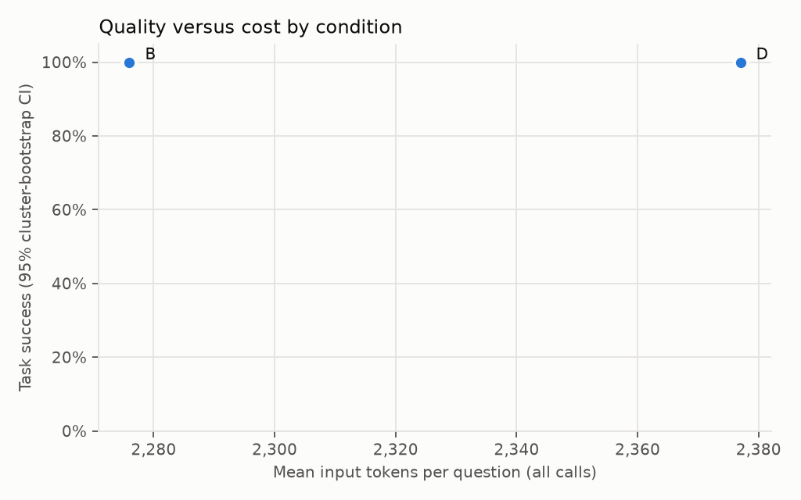

# Results: run `rag-integration-live-fixed-20260927`

Split **dev**, mode **live**, created 2026-09-27T19:30:33+00:00. Benchmark `benchmarks/edan_2025_v1.jsonl` sha256 `5d7a74c72d40` (unfrozen); corpus sha256 `86412bb2b9e8` (300 cards); dense model `intfloat/multilingual-e5-small` rev `614241f622f53c4eeff9890bdc4f31cfecc418b3`; git `a22eb2a97e` (dirty); answer cache disabled.

> Benchmark not frozen at run time: results are provisional.

## End-to-end

Completed runs: 6 of 6 expected (0 not run or stopped at the call cap). Model: `gemini-3.8-flash`.

| Cond. | n | Task success [95% CI] | Answerable correct | Executed | Abstention correct | Slot recall | Complete evid. | p50 s | p95 s | In tok | Out tok | Calls | Retr. calls | Repairs | Cost/success (est.) |
|---|---|---|---|---|---|---|---|---|---|---|---|---|---|---|---|
| B | 3 | 100.0% [100.0%, 100.0%] | 100.0% | 100.0% | – | 100.0% | 100.0% | 20.89 | 41.06 | 2276 | 1180 | 2.00 | 0.00 | 0.00 | – |
| D | 3 | 100.0% [100.0%, 100.0%] | 100.0% | 100.0% | – | 100.0% | 100.0% | 18.95 | 21.11 | 2377 | 1179 | 1.33 | 0.00 | 0.00 | – |

Cost column empty: no dated prices in the config. Token counts are reported instead.

Latency percentiles use n = 3 runs per condition; tail latency from small samples is noisy.

**Paired differences in task success** (cluster bootstrap over paraphrase families, 10,000 resamples; an interval containing 0 is inconclusive).

| Condition | vs | n | Difference | 95% CI |
|---|---|---|---|---|
| D | B | 3 | 0.0% | [0.0%, 0.0%] |

**Task success by question family**

| Family | n q | B | D |
|---|---|---|---|
| aggregation | 1 | 100.0% | 100.0% |
| alias | 1 | 100.0% | 100.0% |
| source_evidence | 1 | 100.0% | 100.0% |

**Failure categories** (rule-based; `semantics` is the residual for manual review)

| Condition |
|---|
| B |
| D |

**Failures for manual inspection** (0)

| Question | Cond. | Outcome | Category | Detail |
|---|---|---|---|---|
