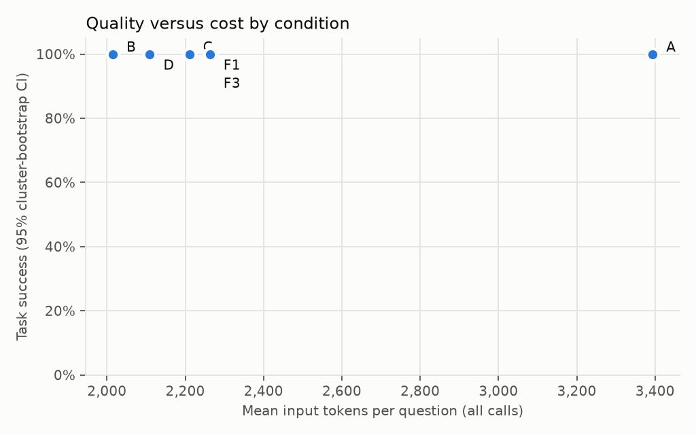

# Results: run `rag-integration-offline-20260927`

Split **dev**, mode **fake**, created 2026-09-27T19:29:24+00:00. Benchmark `benchmarks/edan_2025_v1.jsonl` sha256 `5d7a74c72d40` (unfrozen); corpus sha256 `86412bb2b9e8` (300 cards); dense model `intfloat/multilingual-e5-small` rev `614241f622f53c4eeff9890bdc4f31cfecc418b3`; git `a22eb2a97e` (dirty); answer cache disabled.

> **Pipeline check only.** The fake model returns gold answers; these numbers measure the harness, not any model or retrieval method.

> Benchmark not frozen at run time: results are provisional.

## End-to-end

Completed runs: 18 of 18 expected (0 not run or stopped at the call cap). Model: `fake-gold`.

| Cond. | n | Task success [95% CI] | Answerable correct | Executed | Abstention correct | Slot recall | Complete evid. | p50 s | p95 s | In tok | Out tok | Calls | Retr. calls | Repairs | Cost/success (est.) |
|---|---|---|---|---|---|---|---|---|---|---|---|---|---|---|---|
| A | 3 | 100.0% [100.0%, 100.0%] | 100.0% | 100.0% | – | 66.7% | 0.0% | 0.31 | 0.34 | 3394 | 30 | 1.00 | 0.00 | 0.00 | – |
| B | 3 | 100.0% [100.0%, 100.0%] | 100.0% | 100.0% | – | 100.0% | 100.0% | 0.31 | 0.31 | 2015 | 30 | 1.00 | 0.00 | 0.00 | – |
| C | 3 | 100.0% [100.0%, 100.0%] | 100.0% | 100.0% | – | 88.9% | 66.7% | 0.31 | 0.35 | 2211 | 30 | 1.00 | 0.00 | 0.00 | – |
| D | 3 | 100.0% [100.0%, 100.0%] | 100.0% | 100.0% | – | 100.0% | 100.0% | 0.32 | 0.35 | 2110 | 30 | 1.00 | 0.00 | 0.00 | – |
| F1 | 3 | 100.0% [100.0%, 100.0%] | 100.0% | 100.0% | – | 100.0% | 100.0% | 0.32 | 0.33 | 2263 | 30 | 1.00 | 0.00 | 0.00 | – |
| F3 | 3 | 100.0% [100.0%, 100.0%] | 100.0% | 100.0% | – | 100.0% | 100.0% | 0.32 | 0.40 | 2263 | 30 | 1.00 | 0.00 | 0.00 | – |

Cost column empty: no dated prices in the config. Token counts are reported instead.

Latency percentiles use n = 3 runs per condition; tail latency from small samples is noisy.

**Paired differences in task success** (cluster bootstrap over paraphrase families, 10,000 resamples; an interval containing 0 is inconclusive).

| Condition | vs | n | Difference | 95% CI |
|---|---|---|---|---|
| A | B | 3 | 0.0% | [0.0%, 0.0%] |
| B | A | 3 | 0.0% | [0.0%, 0.0%] |
| C | A | 3 | 0.0% | [0.0%, 0.0%] |
| C | B | 3 | 0.0% | [0.0%, 0.0%] |
| D | A | 3 | 0.0% | [0.0%, 0.0%] |
| D | B | 3 | 0.0% | [0.0%, 0.0%] |
| F1 | A | 3 | 0.0% | [0.0%, 0.0%] |
| F1 | B | 3 | 0.0% | [0.0%, 0.0%] |
| F3 | A | 3 | 0.0% | [0.0%, 0.0%] |
| F3 | B | 3 | 0.0% | [0.0%, 0.0%] |

**Task success by question family**

| Family | n q | A | B | C | D | F1 | F3 |
|---|---|---|---|---|---|---|---|
| aggregation | 1 | 100.0% | 100.0% | 100.0% | 100.0% | 100.0% | 100.0% |
| alias | 1 | 100.0% | 100.0% | 100.0% | 100.0% | 100.0% | 100.0% |
| source_evidence | 1 | 100.0% | 100.0% | 100.0% | 100.0% | 100.0% | 100.0% |

**Retrieval budget (F1 vs F3)**: F1: success 100.0%, 1.00 calls, 0.00 searches, 2263 input tokens; F3: success 100.0%, 1.00 calls, 0.00 searches, 2263 input tokens

**Failure categories** (rule-based; `semantics` is the residual for manual review)

| Condition |
|---|
| A |
| B |
| C |
| D |
| F1 |
| F3 |

**Failures for manual inspection** (0)

| Question | Cond. | Outcome | Category | Detail |
|---|---|---|---|---|
