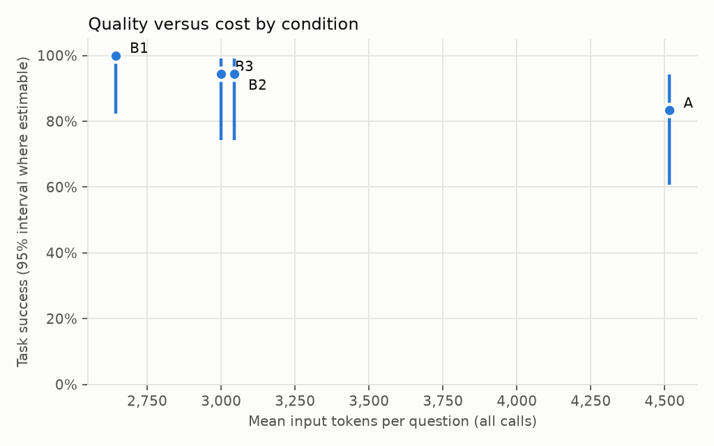
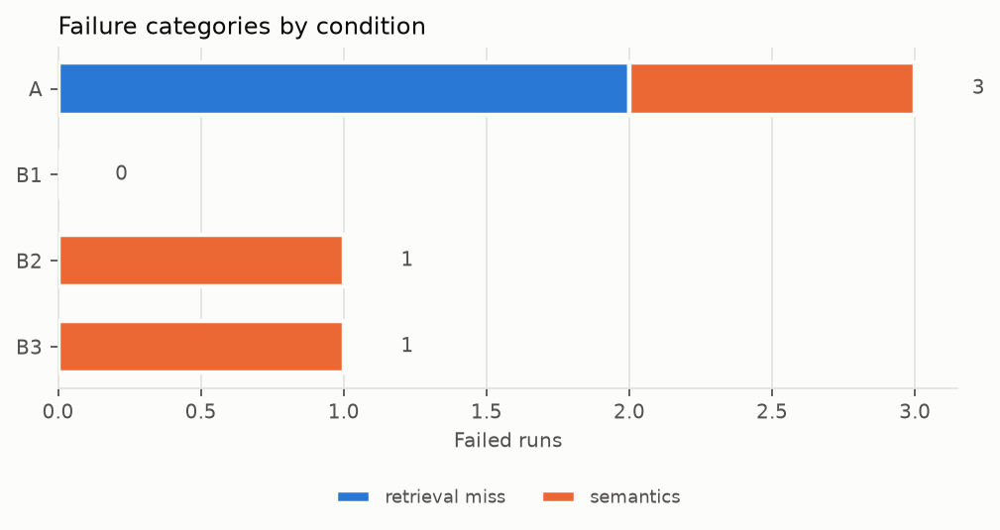

# Results: run `text-to-sql-comparison-haiku-20260930`

Split **dev**, mode **live**, created 2026-09-30T01:22:19+00:00. Benchmark `benchmarks/edan_2025_v1.jsonl` sha256 `5d7a74c72d40` (unfrozen); corpus sha256 `86412bb2b9e8` (300 cards); dense model `intfloat/multilingual-e5-small` rev `614241f622f53c4eeff9890bdc4f31cfecc418b3`; git `a22eb2a97e` (dirty); answer cache disabled.

> Benchmark not frozen at run time: results are provisional.

## End-to-end

Scored trials: 72 of 72 expected (0 not run or stopped at the call cap). Model: `claude-haiku-4-5`.

| Display label | Internal condition | Method |
|---|---|---|
| A | A | Text-to-SQL without retrieval |
| B1 | B | Text-to-SQL + BM25 RAG |
| B2 | C | Text-to-SQL + E5 RAG |
| B3 | D | Text-to-SQL + hybrid RAG |

Baseline A: All 7 schema and 12 domain cards; no entity cards, search or query-dependent context. Same rules and six SQL examples as all RAG conditions.

Budget-stopped or unrun trials are not model errors and are excluded from accuracy. Transport failures remain failures in the end-to-end denominator. Task success accepts a correct result or the benchmark-prescribed abstention/clarification. SQL-result accuracy requires a correct executed result on an answerable item; accepted clarification is reported separately in `summary.csv`. Execution rate alone does not establish correctness.

| Cond. | Task success count | Task success [95% interval] | SQL-result accuracy | Executed | Abstention / clarification correct | Unsupported questions answered | Repair rate |
|---|---|---|---|---|---|---|---|
| A | 15/18 | 83.3% [60.8%, 94.2%] | 11/14 (78.6%) | 14/14 (100.0%) | 4/4 | 0/2 | 0.0% |
| B1 | 18/18 | 100.0% [82.4%, 100.0%] | 14/14 (100.0%) | 14/14 (100.0%) | 4/4 | 0/2 | 0.0% |
| B2 | 17/18 | 94.4% [74.2%, 99.0%] | 13/14 (92.9%) | 14/14 (100.0%) | 4/4 | 0/2 | 0.0% |
| B3 | 17/18 | 94.4% [74.2%, 99.0%] | 13/14 (92.9%) | 14/14 (100.0%) | 4/4 | 0/2 | 0.0% |

Intervals use Wilson for one binary observation per independent paraphrase family; otherwise a 10,000-resample family bootstrap is used. Collapsed bootstrap intervals are withheld, not interpreted as certainty. Repeats are averaged within question for task success. Intervals do not capture benchmark annotation errors or generalization beyond this dataset. Unsupported-answer rate is one observable safety check, not a comprehensive hallucination metric.

| Cond. | Evidence-labeled n | Slot recall | Complete evidence | Latency n | p50 s | p95 s | Mean input tokens | Mean output tokens | Mean API calls | Mean repairs | Cost/success (est.) |
|---|---|---|---|---|---|---|---|---|---|---|---|
| A | 16 | 71.4% | 31.2% | 18 | 1.90 | 2.89 | 4516 | 86 | 1.00 | 0.00 | – |
| B1 | 16 | 79.7% | 62.5% | 18 | 1.71 | 11.94 | 2644 | 84 | 1.06 | 0.00 | – |
| B2 | 16 | 97.9% | 93.8% | 18 | 1.91 | 3.35 | 3044 | 87 | 1.00 | 0.00 | – |
| B3 | 16 | 93.8% | 87.5% | 18 | 1.73 | 3.22 | 2999 | 84 | 1.00 | 0.00 | – |

Cost column empty: no dated prices in the config. Token counts are reported instead.

Latency includes configured pacing, provider retries, context retrieval and SQL execution; it is operational run time, not isolated model speed. Tail latency from small samples is noisy. Input/output tokens are recorded successful-response usage; failed-request billing can be unknown. Condition A retrieves no entity cards, so its evidence coverage is not a retrieval-quality baseline.

**Provider time separated from deliberate pacing** (sum of calls per scored trial; includes provider retries, excludes client pacing).

| Condition | Timed trials | Provider median s | Provider mean s | Pacing mean s |
|---|---|---|---|---|
| A | 18 | 1.63 | 1.72 | 0.00 |
| B1 | 18 | 1.46 | 4.96 | 0.00 |
| B2 | 18 | 1.67 | 1.87 | 0.00 |
| B3 | 18 | 1.43 | 1.69 | 0.00 |

**Prespecified paired differences versus A** (10,000 family-bootstrap resamples; difference in percentage points). Wins/losses count matching trials where only one condition succeeds. Zero-width intervals are withheld; no observed difference is not proof of equivalence. Exact McNemar p-values, when independent pairs permit them, are two-sided and unadjusted for the multiple comparisons; they do not establish superiority.

| Condition | vs | Paired questions | Wins | Losses | Both correct | Both wrong | Difference (pp) | 95% interval (pp) | Exact p (unadjusted) |
|---|---|---|---|---|---|---|---|---|---|
| B1 | A | 18 | 3 | 0 | 15 | 0 | 16.67 | [0.00, 33.33] | 0.2500 |
| B2 | A | 18 | 2 | 0 | 15 | 1 | 11.11 | [0.00, 27.78] | 0.5000 |
| B3 | A | 18 | 3 | 1 | 14 | 0 | 11.11 | [-11.11, 33.33] | 0.6250 |

**Primary paired comparison: strict SQL-result accuracy on answerable questions.** Same uncertainty rules as above; correct clarification is not a correct SQL result.

| Condition | vs | Paired questions | Wins | Losses | Both correct | Both wrong | Difference (pp) | Exact p (unadjusted) |
|---|---|---|---|---|---|---|---|---|
| B1 | A | 14 | 3 | 0 | 11 | 0 | 21.43 | 0.2500 |
| B2 | A | 14 | 2 | 0 | 11 | 1 | 14.29 | 0.5000 |
| B3 | A | 14 | 3 | 1 | 10 | 0 | 14.29 | 0.6250 |

**Task success by question family**

| Family | n q | A | B1 | B2 | B3 |
|---|---|---|---|---|---|
| aggregation | 2 | 100.0% | 100.0% | 100.0% | 100.0% |
| alias | 2 | 50.0% | 100.0% | 50.0% | 100.0% |
| ambiguous | 2 | 100.0% | 100.0% | 100.0% | 100.0% |
| join | 1 | 100.0% | 100.0% | 100.0% | 100.0% |
| lookup | 2 | 50.0% | 100.0% | 100.0% | 100.0% |
| multi_step | 2 | 100.0% | 100.0% | 100.0% | 100.0% |
| ranking | 1 | 100.0% | 100.0% | 100.0% | 100.0% |
| ratio | 2 | 100.0% | 100.0% | 100.0% | 50.0% |
| source_evidence | 2 | 50.0% | 100.0% | 100.0% | 100.0% |
| unsupported | 2 | 100.0% | 100.0% | 100.0% | 100.0% |

**Failure categories** (rule-based; `semantics` is the residual for manual review)

| Condition | retrieval_miss | semantics |
|---|---|---|
| A | 2 | 1 |
| B | 0 | 0 |
| C | 0 | 1 |
| D | 0 | 1 |

**Failures for manual inspection** (5)

| Question | Cond. | Outcome | Category | Detail |
|---|---|---|---|---|
| dev-001 | A | wrong_result | retrieval_miss | empty prediction |
| dev-010 | D | wrong_result | semantics | no predicted column matches ['part'] |
| dev-011 | A | wrong_result | retrieval_miss | empty prediction |
| dev-011 | C | wrong_result | semantics | no predicted column matches ['candidat'] |
| dev-019 | A | wrong_result | semantics | no predicted column matches ['source_page'] |

**All-attempt resource accounting** retains superseded traces and any provider calls recorded before a trial was interrupted. Provider audit totals are preferred when available. No trace or audit can recover a request that crashed before its accounting record was written; failed-request token use may be unknown.

| Condition | Recorded trace attempts | Superseded attempts | Scored calls | All trace calls | Provider audit calls | Provider failures |
|---|---|---|---|---|---|---|
| A | 18 | 0 | 18 | 18 | 18 | 0 |
| B1 | 18 | 0 | 19 | 19 | 19 | 1 |
| B2 | 18 | 0 | 18 | 18 | 18 | 0 |
| B3 | 18 | 0 | 18 | 18 | 18 | 0 |
