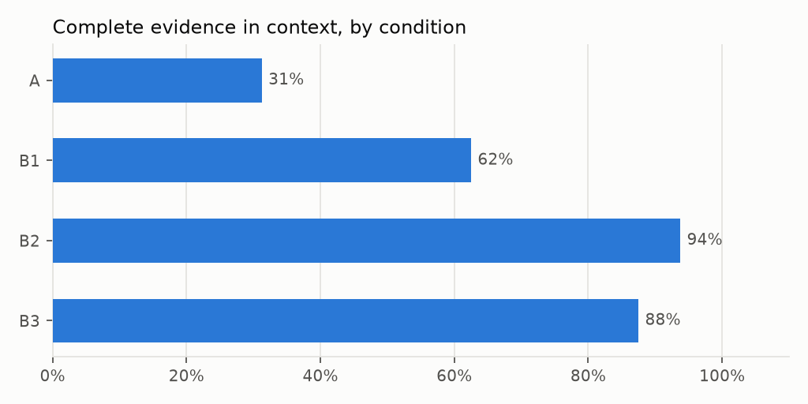

# Results: run `text-to-sql-comparison-retrieval-20260930`

Split **dev**, mode **retrieval-only**, created 2026-09-30T00:50:50+00:00. Benchmark `benchmarks/edan_2025_v1.jsonl` sha256 `5d7a74c72d40` (unfrozen); corpus sha256 `86412bb2b9e8` (300 cards); dense model `intfloat/multilingual-e5-small` rev `614241f622f53c4eeff9890bdc4f31cfecc418b3`; git `a22eb2a97e` (dirty); answer cache disabled.

> Benchmark not frozen at run time: results are provisional.

## Retrieval (no model calls)

Questions with labelled evidence: 16. Slot recall/nDCG/complete-set are computed on the single global ranking (retriever quality); quota coverage is the per-kind context actually fed to the model.

| Retriever | recall@5 | nDCG@5 | complete@5 | recall@10 | nDCG@10 | complete@10 | recall@20 | nDCG@20 | complete@20 | mean ms |
|---|---|---|---|---|---|---|---|---|---|---|
| bm25 | 60.4% | 62.3% | 37.5% | 62.0% | 63.2% | 37.5% | 73.4% | 67.1% | 56.2% | 0.5 |
| dense | 60.9% | 61.7% | 31.2% | 60.9% | 61.7% | 31.2% | 63.0% | 62.4% | 31.2% | 17.3 |
| hybrid | 54.7% | 56.4% | 25.0% | 59.9% | 58.7% | 31.2% | 69.3% | 62.0% | 50.0% | 6.6 |

**Context coverage with per-kind quotas** (schema 3, domain 3, entity k varies): complete-evidence rate / mean slot recall.

| Retriever | entity k=3 | entity k=5 | entity k=8 |
|---|---|---|---|
| bm25 | 62.5% / 79.7% | 62.5% / 79.7% | 62.5% / 79.7% |
| dense | 93.8% / 97.9% | 93.8% / 97.9% | 93.8% / 97.9% |
| hybrid | 87.5% / 93.8% | 87.5% / 93.8% | 87.5% / 93.8% |

**Complete evidence in the context each condition would send**

| Condition | Cards | Complete evidence | Slot recall |
|---|---|---|---|
| A | 19 | 31.2% | 71.4% |
| B1 | 11 | 62.5% | 79.7% |
| B2 | 11 | 93.8% | 97.9% |
| B3 | 11 | 87.5% | 93.8% |

Condition A has no entity cards by design; its coverage counts entity slots as missing even when the model can match names with ILIKE.
